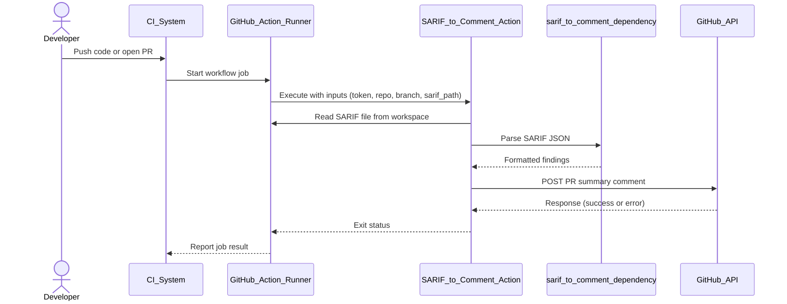

# Threat Model: SARIF to Comment Action

**Target:** [sett-and-hive/sarif-to-comment-action](https://github.com/sett-and-hive/sarif-to-comment-action)
**Date:** November 27, 2025
**Methodology:** STRIDE (Spoofing, Tampering, Repudiation, Information Disclosure, Denial of Service, Elevation of Privilege)

## System Overview

**Description:** This GitHub Action parses a SARIF (Static Analysis Results Interchange Format) file, typically generated
by security scanners like CodeQL, Bandit, or ESLint, and posts a summary of the findings as a comment on a GitHub
Pull Request.

**Key Components:**

1. **GitHub Action Runner:** The ephemeral environment where the code executes.
2. **Input SARIF File:** A JSON file provided by the user (or a previous workflow step).
3. **Node.js Runtime:** The execution environment for the action.
4. **Dependencies:** Specifically the `@security-alert/sarif-to-comment` NPM package.
5. **GitHub API:** The destination where comments are posted.

### Data Flow Diagram (DFD)

```mermaid
graph LR
    User[User / CI Process] -->|Generates| SARIF[SARIF File (Untrusted Input)]
    SARIF -->|Read by| Action[SARIF to Comment Action]
    Config[Action Inputs (Token, Repo, Branch)] --> Action
    Action -->|Parses via| Dep[NPM: @security-alert/sarif-to-comment]
    Dep -->|Formats| Comment[Markdown Comment]
    Action -->|POST| API[GitHub API]
```

## Sequence Diagram (SD)



## Trust Boundaries

### Boundary 1 (Input)

The interface between the SARIF file and the Action logic. The SARIF file is effectively user-controlled input and must
be treated as untrusted.

### Boundary 2 (External)

The interface between the Action and the GitHub API. The Action operates with the privileges of the provided
`GITHUB_TOKEN`.

### Boundary 3 (Supply Chain)

The interface between the Action code and its NPM Dependencies.

## Threat Analysis (STRIDE)

### S - Spoofing

#### Threat

Falsified Security Reports

##### Description

A malicious actor (e.g., a contributor submitting a PR) could manually craft or modify a SARIF file to show
"0 vulnerabilities" even if the code is insecure, or fabricate false positives to confuse reviewers.

##### Impact

Security team relies on false data, merging vulnerable code.

##### Likelihood

Medium

Requires the attacker to understand the CI pipeline structure.

##### Mitigation

Ensure the SARIF file is generated by a trusted tool in a previous trusted step, rather than checking in the
SARIF file to the repository.

### T - Tampering

#### Threat

Dependency Poisoning (`@security-alert/sarif-to-comment`)

##### Description

The action relies on a third-party NPM package. If that package is compromised (supply chain attack),
the action code could be altered to execute malicious logic.

##### Impact

Critical. Could lead to token exfiltration or malicious code execution in the runner.

##### Likelihood

Low/Medium (common vector in Node.js ecosystem).

##### Mitigation

Pin dependencies to specific SHA hashes or lockfiles (package-lock.json) rather than version ranges.

Use Renovate or Dependabot to monitor for upstream vulnerabilities.

#### Threat

content Injection in PR Comments

##### Description

If the SARIF parser does not sanitize rule descriptions or messages, an attacker could embed malicious
Markdown (e.g., misleading links, phishing text, or images that track IP addresses) into the SARIF file.

##### Impact

Low. GitHub sanitizes HTML/JS in comments, but "Phishing via Markdown" is still possible.

##### Mitigation

Ensure the underlying parser escapes special characters before rendering the Markdown table.

### R - Repudiation

#### Threat

Lack of Execution Logs

##### Description

If the action fails to post a comment or posts an incorrect one,
there may be insufficient logging to determine if it was a file parsing error or an API failure.

##### Impact

Low (Operational).

##### Mitigation

Implement verbose logging (visible only when ACTIONS_STEP_DEBUG is true) to trace the parsed JSON structure.

### I - Information Disclosure

#### Threat

Token Exfiltration

##### Description

The action requires inputs.token (usually `secrets.GITHUB_TOKEN`). If the action dumps the environment
variables to the log for debugging, or if a compromised dependency sends environment vars to a remote server,
the token is leaked.

##### Impact

High. The token typically has write access to the repo.

##### Likelihood

Low (standard GitHub Action risk).

##### Mitigation

Ensure `GITHUB_TOKEN` is never printed to console logs. Use the Principle of Least Privilege (grant only
`issues: write` or `pull-requests: write`, not repo scope).

#### Threat

Leaking Private Code Details in Public Comments

##### Description

If the SARIF file contains snippets of code (common in SAST tools) and the repo is private, posting these
snippets into a GitHub Comment might accidentally expose them to users who have access to the Issue but not the
Code (e.g., external collaborators).

##### Impact

Medium.

##### Mitigation

Verify if the SARIF includes source snippets and
provide an option to redact them (show-snippets: false).

### D - Denial of Service

#### Threat

SARIF Bomb (Large File Processing)

##### Description

An attacker submits a PR with a massive (e.g., 500MB) SARIF file.

##### Impact

The Node.js process runs out of memory (OOM), crashing the GitHub Action runner and stalling the CI pipeline.

##### Likelihood

Medium.

##### Mitigation

Implement file size limits or strict timeout/memory constraints on the parsing logic.

#### Threat

API Rate Limiting

##### Description

If the SARIF file contains thousands of findings and the action attempts to post
individual comments for each (or updates the same comment too frequently), it may hit GitHub API rate limits.

##### Impact

CI fails for all developers.

##### Mitigation

The action should aggregate findings into a single summary comment.

### E - Elevation of Privilege

#### Threat

Command Injection via Inputs

##### Description

The action takes inputs like title or branch. If these are passed directly to a shell command (e.g.,
`exec("git checkout " + branch)`), an attacker could name a branch `main; rm -rf /`.

##### Impact

High. Code execution on the runner.

##### Likelihood

Medium. Depends on implementation (using exec vs spawn or API calls).

##### Mitigation

Avoid shell execution. Use the GitHub REST API libraries (@actions/github, octokit) directly. Specific
inputs should be validated against an allowlist (alphanumeric only).

## Summary of Critical Findings

| Severity  | Threat                  | Category  | Remediation                                                                      |
| --------- | ----------------------  |-----------|----------------------------------------------------------------------------------|
| High      | Supply Chain Compromise | Tampering | Pin dependencies and review `@security-alert/sarif-to-comment` security posture. |
| High      | Command Injection       | EoP       | Audit code to ensure inputs (branch, title) are not passed to `exec()`.          |
| Medium    | SARIF "Bomb" / OOM      | DoS       | Add file size checks before parsing JSON.                                        |
| Medium    | Phishing via Markdown   | Tampering | Sanitize text from SARIF before rendering Markdown.                              |

## Next Steps for Engineers

### Code Audit

Search the codebase for `exec`, `spawn`, or `eval` to rule out injection risks. There is the code of the action itself,
but also the code of `@security-alert/sarif-to-comment`.

### Dependency Check

Run npm audit and verify the maintenance status of `@security-alert/sarif-to-comment`.

### Permission Review

Update documentation to recommend minimal permissions (`permissions: pull-requests: write`) in the workflow YAML.

## Vulnerability Management & Exemptions

This section documents specific security findings that have been analyzed, triaged as false positives or acceptable risks, and suppressed in the CI pipeline to maintain a clean build signal.

### CVE-2020-7754: npm-user-validate Regular Expression Denial of Service (ReDoS)

* **Component:** `npm-user-validate` (NPM Package bundled with npm)
* **Scanner:** Trivy
* **Severity:** High (CVSS 7.5)
* **Status:** **Mitigated / Suppressed**
* **Analysis:**
  * **The Vulnerability:** npm-user-validate versions < 1.0.1 contain a ReDoS vulnerability in the email validation regular expression. Attackers could exploit this by providing crafted input with repeated `@` characters, causing exponential backtracking and high CPU usage, leading to denial of service.
  * **The Fix:** The vulnerability was fixed in npm-user-validate 1.0.1 through improved regex and enforced maximum email length (254 characters).
  * **Current Status:** The Dockerfile explicitly installs `npm@latest` (currently 10.8.2+), which bundles npm-user-validate 2.0.1. This is well above the vulnerable version threshold.
  * **Why Trivy Detects It:** Trivy may be detecting npm-user-validate in intermediate build layers or cached images before the `npm install -g npm@latest` and `npm update --depth 99` commands execute.
* **Mitigation:** The vulnerability is fully mitigated through the use of npm@latest, which includes a patched version of npm-user-validate (2.0.1). The finding is suppressed via `.trivyignore` to acknowledge that the vulnerability is addressed through our npm upgrade strategy.
* **References:**
  * [NVD CVE-2020-7754](https://nvd.nist.gov/vuln/detail/CVE-2020-7754)
  * [GitHub Security Advisory](https://github.com/npm/npm-user-validate/security/advisories/GHSA-xgh6-85xh-479p)

### CVE-2024-52308: GitHub CLI (gh) Remote Code Execution

* **Component:** `usr/local/bin/gh` (Go Binary)
* **Scanner:** Trivy
* **Severity:** High
* **Status:** **False Positive / Suppressed**
* **Analysis:**
  * **The Finding:** Trivy flags the embedded module `github.com/cli/cli/v2` as vulnerable to CVE-2024-52308, stating the fixed version is `2.62.0`.
  * **The Error:** Trivy misinterprets the Go pseudo-version string inside the binary (`v2.0.0-20251113...`) as semver `2.0.0`, which appears older than `2.62.0`.
  * **Verification:** We explicitly install `gh` version **2.83.1** (Released November 2025) in the Dockerfile. This version is significantly newer than the patch requirement (`2.62.0`).
* **Mitigation:** The vulnerability is patched in the installed binary. The finding is suppressed via `.trivyignore` to resolve the scanner parsing error.

### CVE-2025-61729: Go Standard Library (stdlib) Denial of Service in crypto/x509

* **Component:** `stdlib` (Go standard library embedded in `gh` binary)
* **Scanner:** Trivy
* **Severity:** High
* **Status:** **Accepted Risk / Suppressed**
* **Analysis:**
  * **The Vulnerability:** Go stdlib versions prior to 1.24.11 and 1.25.5 contain a vulnerability in the crypto/x509 package. The HostnameError.Error() method can print an unbounded number of hostnames using repeated string concatenation, resulting in quadratic runtime. A malicious certificate can cause excessive CPU and memory consumption, leading to denial-of-service (DoS).
  * **The Fix:** The vulnerability was fixed in Go 1.25.5 and Go 1.24.11 by limiting the number of hosts printed and optimizing the string concatenation method.
  * **Current Status:** The Dockerfile explicitly installs `gh` version **2.83.1** (Released November 13, 2025), which was built with Go 1.25.3 (vulnerable version). As of this documentation (December 2025), version 2.83.1 remains the latest GitHub CLI release.
  * **Why We Cannot Upgrade:** The GitHub CLI upstream project has not released a version compiled with Go 1.25.5+ or Go 1.24.11+. We are dependent on the upstream project to rebuild with a patched Go version.
* **Risk Assessment:**
  * **Likelihood:** Low. Exploitation requires the action to process a malicious TLS certificate during GitHub API communication, which would require a compromised GitHub.com infrastructure or successful MITM attack.
  * **Impact:** Medium. DoS would affect only the single workflow run processing the malicious certificate.
* **Mitigation Strategy:**
  1. Monitor the GitHub CLI releases for a version built with Go 1.25.5+ or Go 1.24.11+
  2. Update the Dockerfile immediately when a patched version becomes available
  3. The finding is suppressed via `.trivyignore` as an accepted risk until upstream fix is available
* **Acceptance Date:** 2025-12-06
* **References:**
  * [NVD CVE-2025-61729](https://nvd.nist.gov/vuln/detail/CVE-2025-61729)
  * [Go Issue Tracker #76445](https://github.com/golang/go/issues/76445)
  * [Debian Security Tracker](https://security-tracker.debian.org/tracker/CVE-2025-61729)

### General Dependency Policy

* **OS Level:** The container is built on `node:22-bookworm-slim` to ensure the underlying Debian packages are on the latest stable channel (Debian 12), minimizing system-level CVEs.
* **Node Level:** Native dependencies are compiled/fetched using `--ignore-scripts` to prevent arbitrary code execution during the build phase.
* **Supply Chain:** Sub-dependencies of the wrapped library are force-updated during the Docker build (`npm update --depth 99`) to ensure critical patches are applied even if the upstream `package.json` is stale.
