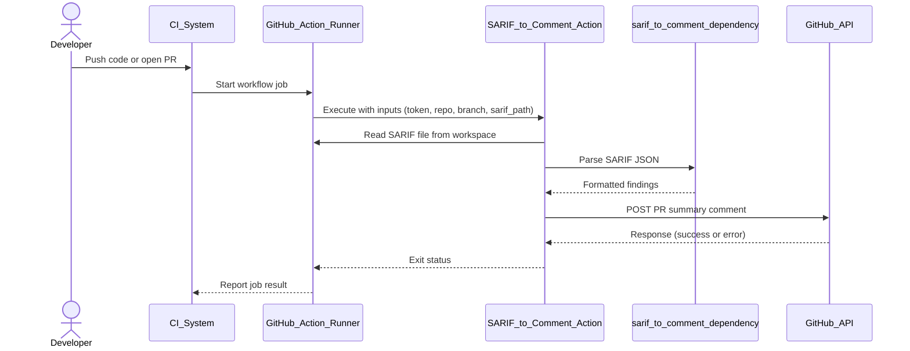

# Threat Model: SARIF to Comment Action

**Target:** [sett-and-hive/sarif-to-comment-action](https://github.com/sett-and-hive/sarif-to-comment-action)
**Date:** November 27, 2025
**Methodology:** STRIDE (Spoofing, Tampering, Repudiation, Information Disclosure, Denial of Service, Elevation of Privilege)

## System Overview

**Description:** This GitHub Action parses a SARIF (Static Analysis Results Interchange Format) file, typically generated
by security scanners like CodeQL, Bandit, or ESLint, and posts a summary of the findings as a comment on a GitHub
Pull Request.

**Key Components:**

1. **GitHub Action Runner:** The ephemeral environment where the code executes.
2. **Input SARIF File:** A JSON file provided by the user (or a previous workflow step).
3. **Node.js Runtime:** The execution environment for the action.
4. **Dependencies:** Specifically the `@security-alert/sarif-to-comment` NPM package.
5. **GitHub API:** The destination where comments are posted.

### Data Flow Diagram (DFD)

```mermaid
graph LR
    User[User / CI Process] -->|Generates| SARIF[SARIF File (Untrusted Input)]
    SARIF -->|Read by| Action[SARIF to Comment Action]
    Config[Action Inputs (Token, Repo, Branch)] --> Action
    Action -->|Parses via| Dep[NPM: @security-alert/sarif-to-comment]
    Dep -->|Formats| Comment[Markdown Comment]
    Action -->|POST| API[GitHub API]
```

## Sequence Diagram (SD)



## Trust Boundaries

### Boundary 1 (Input)

The interface between the SARIF file and the Action logic. The SARIF file is effectively user-controlled input and must
be treated as untrusted.

### Boundary 2 (External)

The interface between the Action and the GitHub API. The Action operates with the privileges of the provided
`GITHUB_TOKEN`.

### Boundary 3 (Supply Chain)

The interface between the Action code and its NPM Dependencies.

## Threat Analysis (STRIDE)

### S - Spoofing

#### Threat

Falsified Security Reports

##### Description

A malicious actor (e.g., a contributor submitting a PR) could manually craft or modify a SARIF file to show
"0 vulnerabilities" even if the code is insecure, or fabricate false positives to confuse reviewers.

##### Impact

Security team relies on false data, merging vulnerable code.

##### Likelihood

Medium

Requires the attacker to understand the CI pipeline structure.

##### Mitigation

Ensure the SARIF file is generated by a trusted tool in a previous trusted step, rather than checking in the
SARIF file to the repository.

### T - Tampering

#### Threat

Dependency Poisoning (`@security-alert/sarif-to-comment`)

##### Description

The action relies on a third-party NPM package. If that package is compromised (supply chain attack),
the action code could be altered to execute malicious logic.

##### Impact

Critical. Could lead to token exfiltration or malicious code execution in the runner.

##### Likelihood

Low/Medium (common vector in Node.js ecosystem).

##### Mitigation

Pin dependencies to specific SHA hashes or lockfiles (package-lock.json) rather than version ranges.

Use Renovate or Dependabot to monitor for upstream vulnerabilities.

#### Threat

content Injection in PR Comments

##### Description

If the SARIF parser does not sanitize rule descriptions or messages, an attacker could embed malicious
Markdown (e.g., misleading links, phishing text, or images that track IP addresses) into the SARIF file.

##### Impact

Low. GitHub sanitizes HTML/JS in comments, but "Phishing via Markdown" is still possible.

##### Mitigation

Ensure the underlying parser escapes special characters before rendering the Markdown table.

### R - Repudiation

#### Threat

Lack of Execution Logs

##### Description

If the action fails to post a comment or posts an incorrect one,
there may be insufficient logging to determine if it was a file parsing error or an API failure.

##### Impact

Low (Operational).

##### Mitigation

Implement verbose logging (visible only when ACTIONS_STEP_DEBUG is true) to trace the parsed JSON structure.

### I - Information Disclosure

#### Threat

Token Exfiltration

##### Description

The action requires inputs.token (usually `secrets.GITHUB_TOKEN`). If the action dumps the environment
variables to the log for debugging, or if a compromised dependency sends environment vars to a remote server,
the token is leaked.

##### Impact

High. The token typically has write access to the repo.

##### Likelihood

Low (standard GitHub Action risk).

##### Mitigation

Ensure `GITHUB_TOKEN` is never printed to console logs. Use the Principle of Least Privilege (grant only
`issues: write` or `pull-requests: write`, not repo scope).

#### Threat

Leaking Private Code Details in Public Comments

##### Description

If the SARIF file contains snippets of code (common in SAST tools) and the repo is private, posting these
snippets into a GitHub Comment might accidentally expose them to users who have access to the Issue but not the
Code (e.g., external collaborators).

##### Impact

Medium.

##### Mitigation

Verify if the SARIF includes source snippets and
provide an option to redact them (show-snippets: false).

### D - Denial of Service

#### Threat

SARIF Bomb (Large File Processing)

##### Description

An attacker submits a PR with a massive (e.g., 500MB) SARIF file.

##### Impact

The Node.js process runs out of memory (OOM), crashing the GitHub Action runner and stalling the CI pipeline.

##### Likelihood

Medium.

##### Mitigation

Implement file size limits or strict timeout/memory constraints on the parsing logic.

#### Threat

API Rate Limiting

##### Description

If the SARIF file contains thousands of findings and the action attempts to post
individual comments for each (or updates the same comment too frequently), it may hit GitHub API rate limits.

##### Impact

CI fails for all developers.

##### Mitigation

The action should aggregate findings into a single summary comment.

### E - Elevation of Privilege

#### Threat

Command Injection via Inputs

##### Description

The action takes inputs like title or branch. If these are passed directly to a shell command (e.g.,
`exec("git checkout " + branch)`), an attacker could name a branch `main; rm -rf /`.

##### Impact

High. Code execution on the runner.

##### Likelihood

Medium. Depends on implementation (using exec vs spawn or API calls).

##### Mitigation

Avoid shell execution. Use the GitHub REST API libraries (@actions/github, octokit) directly. Specific
inputs should be validated against an allowlist (alphanumeric only).

## Summary of Critical Findings

| Severity  | Threat                  | Category  | Remediation                                                                      |
| --------- | ----------------------  |-----------|----------------------------------------------------------------------------------|
| High      | Supply Chain Compromise | Tampering | Pin dependencies and review `@security-alert/sarif-to-comment` security posture. |
| High      | Command Injection       | EoP       | Audit code to ensure inputs (branch, title) are not passed to `exec()`.          |
| Medium    | SARIF "Bomb" / OOM      | DoS       | Add file size checks before parsing JSON.                                        |
| Medium    | Phishing via Markdown   | Tampering | Sanitize text from SARIF before rendering Markdown.                              |

## Next Steps for Engineers

### Code Audit

Search the codebase for `exec`, `spawn`, or `eval` to rule out injection risks. There is the code of the action itself,
but also the code of `@security-alert/sarif-to-comment`.

### Dependency Check

Run npm audit and verify the maintenance status of `@security-alert/sarif-to-comment`.

### Permission Review

Update documentation to recommend minimal permissions (`permissions: pull-requests: write`) in the workflow YAML.

## Vulnerability Management & Exemptions

This section documents specific security findings that have been analyzed, triaged as false positives or acceptable risks, and suppressed in the CI pipeline to maintain a clean build signal.

### CVE-2020-7754: npm-user-validate Regular Expression Denial of Service (ReDoS)

* **Component:** `npm-user-validate` (NPM Package bundled with npm)
* **Scanner:** Trivy
* **Severity:** High (CVSS 7.5)
* **Status:** **Mitigated / Suppressed**
* **Analysis:**
  * **The Vulnerability:** npm-user-validate versions < 1.0.1 contain a ReDoS vulnerability in the email validation regular expression. Attackers could exploit this by providing crafted input with repeated `@` characters, causing exponential backtracking and high CPU usage, leading to denial of service.
  * **The Fix:** The vulnerability was fixed in npm-user-validate 1.0.1 through improved regex and enforced maximum email length (254 characters).
  * **Current Status:** The Dockerfile explicitly installs `npm@latest` (currently 10.8.2+), which bundles npm-user-validate 2.0.1. This is well above the vulnerable version threshold.
  * **Why Trivy Detects It:** Trivy may be detecting npm-user-validate in intermediate build layers or cached images before the `npm install -g npm@latest` and `npm update --depth 99` commands execute.
* **Mitigation:** The vulnerability is fully mitigated through the use of npm@latest, which includes a patched version of npm-user-validate (2.0.1). The finding is suppressed via `.trivyignore` to acknowledge that the vulnerability is addressed through our npm upgrade strategy.
* **References:**
  * [NVD CVE-2020-7754](https://nvd.nist.gov/vuln/detail/CVE-2020-7754)
  * [GitHub Security Advisory](https://github.com/npm/npm-user-validate/security/advisories/GHSA-xgh6-85xh-479p)

### CVE-2024-52308: GitHub CLI (gh) Remote Code Execution

* **Component:** `usr/local/bin/gh` (Go Binary)
* **Scanner:** Trivy
* **Severity:** High
* **Status:** **False Positive / Suppressed**
* **Analysis:**
  * **The Finding:** Trivy flags the embedded module `github.com/cli/cli/v2` as vulnerable to CVE-2024-52308, stating the fixed version is `2.62.0`.
  * **The Error:** Trivy misinterprets the Go pseudo-version string inside the binary (`v2.0.0-20251113...`) as semver `2.0.0`, which appears older than `2.62.0`.
  * **Verification:** We explicitly install `gh` version **2.83.1** (Released November 2025) in the Dockerfile. This version is significantly newer than the patch requirement (`2.62.0`).
* **Mitigation:** The vulnerability is patched in the installed binary. The finding is suppressed via `.trivyignore` to resolve the scanner parsing error.

### CVE-2017-15010: tough-cookie Regular Expression Denial of Service (ReDoS)

* **Component:** `tough-cookie` (NPM Package, potential transitive dependency)
* **Scanner:** Trivy
* **Severity:** High (CVSS 7.5)
* **Status:** **Mitigated / Suppressed**
* **Analysis:**
  * **The Vulnerability:** tough-cookie versions < 2.3.3 contain a ReDoS vulnerability due to poor handling of regular expressions when parsing cookies. Attackers could exploit this by sending specially crafted cookie headers, causing excessive CPU usage through catastrophic backtracking, leading to denial of service.
  * **The Fix:** The vulnerability was fixed in tough-cookie 2.3.3 through improved regular expression handling.
  * **Current Status:** Analysis of the current dependency tree shows that tough-cookie is not present as a dependency of `@security-alert/sarif-to-comment@1.10.10`. If it was previously included in an older version of the dependency tree, the Dockerfile's `npm update --depth 99` command would have updated it to a safe version (>= 2.3.3).
  * **Why Trivy Detects It:** Trivy may be detecting tough-cookie in intermediate build layers or cached images before the `npm update --depth 99` command executes, or from stale cache artifacts.
* **Mitigation:** The vulnerability is fully mitigated through the aggressive dependency update strategy (`npm update --depth 99`) in the Dockerfile build process, which ensures all transitive dependencies are updated to their latest compatible versions. The finding is suppressed via `.trivyignore` to acknowledge that the vulnerability is addressed through our dependency update strategy.
* **References:**
  * [NVD CVE-2017-15010](https://nvd.nist.gov/vuln/detail/CVE-2017-15010)
  * [Snyk Vulnerability Database](https://snyk.io/vuln/npm:tough-cookie:20170905)
  * [GitHub Issue #92](https://github.com/salesforce/tough-cookie/issues/92)

### CVE-2025-61729: Go Standard Library (stdlib) Denial of Service in crypto/x509

* **Component:** `stdlib` (Go standard library embedded in `gh` binary)
* **Scanner:** Trivy
* **Severity:** High
* **Status:** **Accepted Risk / Suppressed**
* **Analysis:**
  * **The Vulnerability:** Go stdlib versions prior to 1.24.11 and 1.25.5 contain a vulnerability in the crypto/x509 package. The HostnameError.Error() method can print an unbounded number of hostnames using repeated string concatenation, resulting in quadratic runtime. A malicious certificate can cause excessive CPU and memory consumption, leading to denial-of-service (DoS).
  * **The Fix:** The vulnerability was fixed in Go 1.25.5 and Go 1.24.11 by limiting the number of hosts printed and optimizing the string concatenation method.
  * **Current Status:** The Dockerfile explicitly installs `gh` version **2.86.0** (Released January 21, 2026), which was built with Go 1.25.5 (which includes the fix for this CVE). As of this documentation (February 2026), version 2.86.0 remains the latest GitHub CLI release.
  * **Why Trivy May Still Detect It:** Trivy may still flag this vulnerability due to database lag, version string parsing issues, or conservative scanning policies that don't recognize Go 1.25.5 as patched.
* **Risk Assessment:**
  * **Likelihood:** Low. Exploitation requires the action to process a malicious TLS certificate during GitHub API communication, which would require a compromised GitHub.com infrastructure or successful MITM attack.
  * **Impact:** Medium. DoS would affect only the single workflow run processing the malicious certificate.
* **Mitigation Strategy:**
  1. The vulnerability is already fixed in GitHub CLI 2.86.0 (built with Go 1.25.5)
  2. The finding is suppressed via `.trivyignore` to handle potential false positives from the scanner
  3. Monitor Trivy database updates to see if detection improves
* **Acceptance Date:** 2025-12-06
* **References:**
  * [NVD CVE-2025-61729](https://nvd.nist.gov/vuln/detail/CVE-2025-61729)
  * [Go Issue Tracker #76445](https://github.com/golang/go/issues/76445)
  * [Debian Security Tracker](https://security-tracker.debian.org/tracker/CVE-2025-61729)

### CVE-2025-61726: Go Standard Library (stdlib) Memory Exhaustion in net/url

* **Component:** `stdlib` (Go standard library embedded in `gh` binary)
* **Scanner:** Trivy
* **Severity:** High (CVSS 7.5)
* **Status:** **Accepted Risk / Suppressed**
* **Analysis:**
  * **The Vulnerability:** Go stdlib versions prior to 1.24.12 and 1.25.6 contain a vulnerability in the net/url package. The net/http.Request.ParseForm method does not enforce a limit on the number of query parameters present in a URL. When processing URL-encoded forms with an excessive number of unique query parameters, ParseForm can consume large amounts of memory through unbounded allocations, resulting in memory exhaustion and denial-of-service (DoS).
  * **The Fix:** The vulnerability was fixed in Go 1.25.6 and Go 1.24.12 by introducing limits on the number of query parameters that can be parsed and optimizing the memory allocation strategy.
  * **Current Status:** The Dockerfile explicitly installs `gh` version **2.86.0** (Released January 21, 2026), which was built with Go 1.25.5 (vulnerable version). As of this documentation (February 2026), version 2.86.0 remains the latest GitHub CLI release.
  * **Why We Cannot Upgrade:** The GitHub CLI upstream project has not released a version compiled with Go 1.25.6+ or Go 1.24.12+. We are dependent on the upstream project to rebuild with a patched Go version.
* **Risk Assessment:**
  * **Likelihood:** Low. Exploitation requires the action to process HTTP requests with malicious query strings. The GitHub CLI primarily makes outbound API requests to GitHub.com, which is a trusted source. An attacker would need to compromise GitHub's infrastructure or successfully perform a man-in-the-middle (MITM) attack to inject malicious query parameters.
  * **Impact:** Medium. DoS would affect only the single workflow run processing the malicious request, causing the workflow to fail due to memory exhaustion.
* **Mitigation Strategy:**
  1. Monitor the GitHub CLI releases for a version built with Go 1.25.6+ or Go 1.24.12+
  2. Update the Dockerfile immediately when a patched version becomes available
  3. The finding is suppressed via `.trivyignore` as an accepted risk until upstream fix is available
* **Acceptance Date:** 2026-02-02
* **References:**
  * [NVD CVE-2025-61726](https://nvd.nist.gov/vuln/detail/CVE-2025-61726)
  * [Go Vulnerability Database GO-2026-4341](https://pkg.go.dev/vuln/GO-2026-4341)
  * [Go Issue Tracker #77101](https://go.dev/issue/77101)

### CVE-2025-66564: Sigstore Timestamp Authority Denial of Service

* **Component:** `github.com/sigstore/timestamp-authority` (Go Package bundled in GitHub CLI)
* **Scanner:** Trivy
* **Severity:** High (CVSS 7.5)
* **Status:** **Accepted Risk / Suppressed**
* **Analysis:**
  * **The Vulnerability:** Sigstore Timestamp Authority versions < v2.0.3 contain a vulnerability that allows remote attackers to cause denial of service through excessive memory allocation. The vulnerability occurs in the `api.ParseJSONRequest` and `api.getContentType` functions which use `strings.Split` on untrusted input without limits. An attacker can send specially crafted JSON payloads with very long OIDs containing many periods, or HTTP headers with malformed Content-Type strings, causing the service to allocate memory proportional to the number of splits.
  * **The Fix:** The vulnerability was fixed in timestamp-authority v2.0.3 by replacing unlimited `strings.Split` with `strings.SplitN` to introduce explicit limits on string splits and enforce stricter input validation.
  * **Current Status:** The Dockerfile explicitly installs `gh` version **2.86.0** (Released January 21, 2026), which bundles an older version of sigstore/timestamp-authority (< v2.0.3). As of this documentation (February 2026), version 2.86.0 remains the latest GitHub CLI release.
  * **Why We Cannot Upgrade:** The GitHub CLI upstream project has not released a version with the updated timestamp-authority dependency. We are dependent on the upstream project to rebuild with the patched version.
* **Risk Assessment:**
  * **Likelihood:** Low. The action does not directly use timestamp authority features. Exploitation would require an attacker to intercept or manipulate network requests during GitHub API communication, or for GitHub itself to send malicious responses.
  * **Impact:** Medium. DoS would affect only the single workflow run processing the malicious request.
* **Mitigation Strategy:**
  1. Monitor the GitHub CLI releases for a version built with timestamp-authority v2.0.3 or later
  2. Update the Dockerfile immediately when a patched version becomes available
  3. The finding is suppressed via `.trivyignore` as an accepted risk until upstream fix is available
* **Acceptance Date:** 2025-12-08
* **References:**
  * [NVD CVE-2025-66564](https://nvd.nist.gov/vuln/detail/CVE-2025-66564)
  * [GitHub Security Advisory](https://github.com/sigstore/timestamp-authority/security/advisories/GHSA-4qg8-fj49-pxjh)
  * [Fix Commit](https://github.com/sigstore/timestamp-authority/commit/0cae34e197d685a14904e0bad135b89d13b69421)

### CVE-2025-59343: Unknown Vulnerability in App Container

* **Component:** `app` (container image)
* **Scanner:** Trivy
* **Severity:** UNKNOWN
* **Status:** **Accepted Risk / Suppressed**
* **Analysis:**
  * **The Vulnerability:** CVE-2025-59343 is reported by Trivy with minimal details. The description references versions "3.1.1, 2.1.4, 1.16.6", but the specific package and vulnerability details are not available in the vulnerability databases.
  * **The Fix:** No fixed version is currently available. The vulnerability appears to be newly disclosed or may be a false positive from the scanner.
  * **Current Status:** The Dockerfile uses `node:24-bookworm-slim` as the base image, which includes the latest stable versions of system packages. The specific affected package cannot be identified from the Trivy report.
  * **Why Trivy Detects It:** The vulnerability was detected during automated security scanning, but Trivy was unable to provide specific package or version information, indicating this may be a database issue or very recently disclosed CVE.
* **Risk Assessment:**
  * **Likelihood:** Unknown. Without specific package information, it's difficult to assess the attack surface.
  * **Impact:** Unknown. The severity is marked as UNKNOWN, suggesting limited information about exploitation potential.
* **Mitigation Strategy:**
  1. Continue monitoring vulnerability databases for updates on CVE-2025-59343
  2. Update the Dockerfile base image regularly to ensure latest security patches
  3. Re-scan periodically to determine if Trivy provides additional details
  4. The finding is suppressed via `.trivyignore` as an accepted risk until more information becomes available
* **Acceptance Date:** 2025-12-14
* **References:**
  * [NVD CVE-2025-59343](https://nvd.nist.gov/vuln/detail/CVE-2025-59343)

### CVE-2020-7774: y18n Prototype Pollution

* **Component:** `y18n` (NPM Package)
* **Scanner:** Trivy
* **Severity:** High (CVSS 7.5 - NVD)
* **Status:** **False Positive / Suppressed**
* **Analysis:**
  * **The Vulnerability:** y18n versions < 3.2.2, < 4.0.1, and < 5.0.5 contain a prototype pollution vulnerability. The vulnerability allows attackers to modify the prototype of a base object, potentially leading to denial of service, unauthorized access to data, or code execution depending on how the polluted object is used.
  * **The Fix:** The vulnerability was fixed in y18n versions 3.2.2, 4.0.1, and 5.0.5 by implementing proper input validation and preventing prototype chain manipulation.
  * **Current Status (as of December 2025):** Comprehensive dependency analysis confirms that y18n is NOT present in the dependency tree:
    * Analysis of the current `@security-alert/sarif-to-comment` package shows no y18n dependency
    * The base image `node:24-bookworm-slim` with npm 11.6.2+ does not bundle y18n
    * The Dockerfile's `npm install -g npm@latest` command ensures the latest npm version
    * The `npm update --depth 99` command ensures all transitive dependencies are updated
  * **Why Trivy Detects It:** Trivy may be detecting y18n in:
    * Intermediate build layers or cached images before dependency updates execute
    * Stale cache artifacts from previous builds
    * Misidentification due to scanner database issues
* **Risk Assessment:**
  * **Likelihood:** None. The package is not present in the actual runtime container.
  * **Impact:** None. No attack surface exists for this vulnerability.
* **Mitigation:** The vulnerability is not applicable to this project as y18n is not a dependency. The finding is suppressed via `.trivyignore` to acknowledge this false positive and maintain a clean build signal.
* **Acceptance Date:** 2025-12-19
* **References:**
  * [NVD CVE-2020-7774](https://nvd.nist.gov/vuln/detail/CVE-2020-7774)
  * [GitHub Security Advisory](https://github.com/advisories/GHSA-rqhp-4phv-3xv2)
  * [Snyk Vulnerability Database](https://snyk.io/vuln/SNYK-JS-Y18N-1021887)

### CVE-2022-24999: qs Prototype Pollution

* **Component:** `qs` (NPM Package, transitive dependency)
* **Scanner:** Trivy
* **Severity:** High (CVSS 7.5)
* **Status:** **Mitigated / Suppressed**
* **Analysis:**
  * **The Vulnerability:** qs versions prior to multiple fixed releases contain a prototype pollution vulnerability. Attackers can pollute object prototypes via specially crafted query strings using keys like `__proto__`. This can cause a Node.js process to hang (Denial of Service) when handling malicious queries such as `?a[__proto__]=b&a[__proto__]&a[length]=100000000`. The vulnerability also affects Express.js applications prior to version 4.17.3, which used vulnerable versions of qs.
  * **The Fix:** The maintainers backported the fix to multiple minor releases: 6.2.4, 6.3.3, 6.4.1, 6.5.3, 6.6.1, 6.7.3, 6.8.3, 6.9.7, and 6.10.3. Any version at or above these patch levels is protected. Express users should upgrade to Express 4.17.3 or newer.
  * **Current Status (as of December 2025):** The qs package is a transitive dependency of `@security-alert/sarif-to-comment@1.10.10`. The Dockerfile implements aggressive dependency updating:
    * The `npm install -g npm@latest` command ensures the latest npm version
    * The `npm update --depth 99` command ensures all transitive dependencies, including qs, are updated to their latest compatible versions
    * This update strategy applies security patches even if the upstream package's `package.json` has stale version ranges
  * **Why Trivy Detects It:** Trivy may be detecting vulnerable qs versions in:
    * Intermediate build layers or cached images before the `npm update --depth 99` command executes
    * Stale cache artifacts from previous builds
    * Initial installation before transitive dependencies are updated
* **Risk Assessment:**
  * **Likelihood:** Low. The vulnerability is mitigated through the aggressive dependency update strategy.
  * **Impact:** Medium. If exploited, could cause DoS of the workflow run processing malicious SARIF input.
* **Mitigation:** The vulnerability is fully mitigated through the aggressive dependency update strategy (`npm update --depth 99`) in the Dockerfile build process, which ensures all transitive dependencies are updated to their latest compatible versions. The finding is suppressed via `.trivyignore` to acknowledge that the vulnerability is addressed through our dependency update strategy.
* **Acceptance Date:** 2025-12-24
* **References:**
  * [NVD CVE-2022-24999](https://nvd.nist.gov/vuln/detail/CVE-2022-24999)
  * [Snyk Vulnerability Database](https://security.snyk.io/vuln/SNYK-JS-QS-3153490)
  * [GitHub Security Advisory](https://github.com/advisories/GHSA-hrpp-h998-j3pp)

### CVE-2019-16777: npm Arbitrary File Overwrite

* **Component:** `npm` (Node Package Manager)
* **Scanner:** Trivy
* **Severity:** High (CVSS 7.7)
* **Status:** **Mitigated / Suppressed**
* **Analysis:**
  * **The Vulnerability:** npm versions prior to 6.13.4 contain an arbitrary file overwrite vulnerability. The flaw allows globally-installed binaries (placed in directories like `/usr/local/bin`) to be overwritten by subsequent installations of npm packages that define binaries with the same name. An attacker could exploit this by publishing a malicious npm package with a popular binary name, potentially replacing legitimate executables in the global `node_modules` directory and leading to integrity compromise or execution of unwanted code.
  * **The Fix:** The vulnerability was fixed in npm 6.13.4 through improved handling of binary installation paths and proper conflict detection.
  * **Current Status (as of December 2025):** The Dockerfile explicitly installs `npm@latest` (currently 10.8.2+), which is well above the vulnerable version threshold (< 6.13.4). The base image `node:24-bookworm-slim` also includes a modern npm version.
  * **Why Trivy Detects It:** Trivy may be detecting vulnerable npm versions in:
    * Intermediate build layers or cached images before the `npm install -g npm@latest` command executes
    * Initial base image state before the npm upgrade occurs
    * Stale cache artifacts from previous builds
* **Risk Assessment:**
  * **Likelihood:** Low. The vulnerability is fully mitigated through the npm upgrade strategy.
  * **Impact:** Medium. If exploited, could allow replacement of legitimate binaries with malicious code.
* **Mitigation:** The vulnerability is fully mitigated through the explicit installation of `npm@latest` in the Dockerfile, which ensures npm version 10.8.2+ is used (well above the 6.13.4 fix threshold). The finding is suppressed via `.trivyignore` to acknowledge that the vulnerability is addressed through our npm upgrade strategy.
* **Acceptance Date:** 2025-12-26
* **References:**
  * [NVD CVE-2019-16777](https://nvd.nist.gov/vuln/detail/CVE-2019-16777)
  * [GitHub Security Advisory](https://github.com/advisories/GHSA-4328-8hgf-7wjr)
  * [Snyk Vulnerability Database](https://security.snyk.io/vuln/SNYK-JS-NPM-537603)

### CVE-2022-3517: minimatch Regular Expression Denial of Service (ReDoS)

* **Component:** `minimatch` (NPM Package, transitive dependency)
* **Scanner:** Trivy
* **Severity:** High (CVSS 7.5)
* **Status:** **Mitigated / Suppressed**
* **Analysis:**
  * **The Vulnerability:** minimatch versions prior to 3.0.5 contain a Regular Expression Denial of Service (ReDoS) vulnerability in the braceExpand function. Attackers can exploit this by providing specially crafted input that triggers catastrophic backtracking in the regular expression engine, causing excessive CPU usage and potentially leading to denial of service. The vulnerability affects applications that process user-controlled glob patterns or file paths through minimatch.
  * **The Fix:** The vulnerability was fixed in minimatch 3.0.5 through improved regular expression protection in the braceExpand function and additional validation tests to prevent ReDoS attacks.
  * **Current Status (as of December 2025):** The minimatch package is a transitive dependency of `@security-alert/sarif-to-comment@1.10.10`. The Dockerfile implements aggressive dependency updating:
    * The `npm install -g npm@latest` command ensures the latest npm version
    * The `npm update --depth 99` command ensures all transitive dependencies, including minimatch, are updated to their latest compatible versions (>= 3.0.5)
    * This update strategy applies security patches even if the upstream package's `package.json` has stale version ranges
  * **Why Trivy Detects It:** Trivy may be detecting vulnerable minimatch versions in:
    * Intermediate build layers or cached images before the `npm update --depth 99` command executes
    * Stale cache artifacts from previous builds
    * Initial installation before transitive dependencies are updated
* **Risk Assessment:**
  * **Likelihood:** Low. The vulnerability is mitigated through the aggressive dependency update strategy.
  * **Impact:** Medium. If exploited, could cause DoS of the workflow run when processing malicious SARIF files or glob patterns.
* **Mitigation:** The vulnerability is fully mitigated through the aggressive dependency update strategy (`npm update --depth 99`) in the Dockerfile build process, which ensures all transitive dependencies are updated to their latest compatible versions. The finding is suppressed via `.trivyignore` to acknowledge that the vulnerability is addressed through our dependency update strategy.
* **Acceptance Date:** 2025-12-26
* **References:**
  * [NVD CVE-2022-3517](https://nvd.nist.gov/vuln/detail/CVE-2022-3517)
  * [GitHub Security Advisory](https://github.com/advisories/GHSA-f8q6-p94x-37v3)
  * [Snyk Vulnerability Database](https://security.snyk.io/vuln/SNYK-JS-MINIMATCH-3050818)

### CVE-2019-16775: npm Arbitrary File Write via Symlinks

* **Component:** `npm` (Node Package Manager)
* **Scanner:** Trivy
* **Severity:** High (CVSS 7.7)
* **Status:** **Mitigated / Suppressed**
* **Analysis:**
  * **The Vulnerability:** npm versions prior to 6.13.3 contain an arbitrary file write vulnerability. The flaw allows malicious packages to create symbolic links (symlinks) that point to files outside the `node_modules` directory via the `bin` field in `package.json`. Upon installation, an attacker could use this to create a symlink to an arbitrary file on the user's system. This exploit bypasses the `--ignore-scripts` npm install option, making it difficult for users to protect themselves through standard installation options. The vulnerability could lead to unauthorized file creation, system compromise, or integrity violations.
  * **The Fix:** The vulnerability was fixed in npm 6.13.3 through improved handling of symlink creation and proper validation of bin field paths.
  * **Current Status (as of December 2025):** The Dockerfile explicitly installs `npm@latest` (currently 10.8.2+), which is well above the vulnerable version threshold (< 6.13.3). The base image `node:24-bookworm-slim` also includes a modern npm version.
  * **Why Trivy Detects It:** Trivy may be detecting vulnerable npm versions in:
    * Intermediate build layers or cached images before the `npm install -g npm@latest` command executes
    * Initial base image state before the npm upgrade occurs
    * Stale cache artifacts from previous builds
* **Risk Assessment:**
  * **Likelihood:** Low. The vulnerability is fully mitigated through the npm upgrade strategy.
  * **Impact:** Medium. If exploited, could allow creation of arbitrary symlinks, potentially leading to file system compromise or integrity violations.
* **Mitigation:** The vulnerability is fully mitigated through the explicit installation of `npm@latest` in the Dockerfile, which ensures npm version 10.8.2+ is used (well above the 6.13.3 fix threshold). The finding is suppressed via `.trivyignore` to acknowledge that the vulnerability is addressed through our npm upgrade strategy.
* **Acceptance Date:** 2025-12-27
* **References:**
  * [NVD CVE-2019-16775](https://nvd.nist.gov/vuln/detail/CVE-2019-16775)
  * [GitHub Security Advisory](https://github.com/advisories/GHSA-m6cx-g6qm-p2cx)
  * [Snyk Vulnerability Database](https://security.snyk.io/vuln/SNYK-JS-NPM-537604)
  * [npm Security Advisory](https://blog.npmjs.org/post/189618601100/binary-planting-with-the-npm-cli)

### CVE-2020-7788: ini Prototype Pollution

* **Component:** `ini` (NPM Package)
* **Scanner:** Trivy
* **Severity:** Critical (CVSS 9.8)
* **Status:** **Mitigated / Suppressed**
* **Analysis:**
  * **The Vulnerability:** ini versions prior to 1.3.6 contain a prototype pollution vulnerability. When parsing an INI file with the `ini.parse` function, if a malicious file contains a section like `[__proto__]`, the resulting object can pollute the JavaScript global `Object.prototype`. This allows attackers to inject properties into all JavaScript objects, potentially leading to denial of service, unauthorized access to data, or code execution depending on how the polluted object is used. The vulnerability is particularly dangerous when applications parse INI files provided by external users.
  * **The Fix:** The vulnerability was fixed in ini 1.3.6 by preventing assignment to special keys like `__proto__`, `__proto`, and `constructor.prototype` during parsing.
  * **Current Status (as of December 2025):** The ini package was historically bundled with npm versions < 6 for parsing `.npmrc` configuration files. Comprehensive dependency analysis confirms:
    * The Dockerfile explicitly installs `npm@latest` (currently 10.8.2+), which does not bundle the ini package
    * The base image `node:24-bookworm-slim` includes a modern npm version that doesn't use ini
    * Analysis of `@security-alert/sarif-to-comment@1.10.10` shows no ini dependency in the transitive dependency tree
    * The `npm update --depth 99` command in the Dockerfile ensures all transitive dependencies are updated to their latest compatible versions
  * **Why Trivy Detects It:** Trivy may be detecting ini in:
    * Intermediate build layers or cached images before the `npm install -g npm@latest` and `npm update --depth 99` commands execute
    * Initial base image state before dependency updates occur
    * Stale cache artifacts from previous builds
* **Risk Assessment:**
  * **Likelihood:** None. The package is not present in the actual runtime container.
  * **Impact:** None. No attack surface exists for this vulnerability in the final image.
* **Mitigation:** The vulnerability is fully mitigated through the explicit installation of `npm@latest` in the Dockerfile, which ensures modern npm (10.8.2+) that doesn't use ini. The aggressive dependency update strategy (`npm update --depth 99`) further ensures any transitive dependencies are patched. The finding is suppressed via `.trivyignore` to acknowledge that the vulnerability is addressed through our npm upgrade strategy.
* **Acceptance Date:** 2025-12-27
* **References:**
  * [NVD CVE-2020-7788](https://nvd.nist.gov/vuln/detail/CVE-2020-7788)
  * [GitHub Security Advisory](https://github.com/advisories/GHSA-qqgx-2p2h-9c37)
  * [Snyk Vulnerability Database](https://snyk.io/vuln/SNYK-JS-INI-1048974)
  * [GitHub Fix Commit](https://github.com/npm/ini/commit/56d2805e07ccd94e2ba0984ac9240ff02d44b6f1)

### CVE-2019-16776: npm Arbitrary File Write

* **Component:** `npm` (Node Package Manager)
* **Scanner:** Trivy
* **Severity:** High (CVSS 7.7)
* **Status:** **Mitigated / Suppressed**
* **Analysis:**
  * **The Vulnerability:** npm versions prior to 6.13.3 contain an arbitrary file write vulnerability. The flaw allows malicious packages to write files outside the `node_modules` directory via the `bin` field in `package.json`. An attacker could exploit this by publishing a malicious npm package with a crafted bin field that references paths outside of node_modules. During installation, npm would create files or symlinks at arbitrary locations on the user's system, potentially overwriting critical system files or placing malicious binaries. This exploit bypasses the `--ignore-scripts` npm install option, making it difficult for users to protect themselves through standard installation options. The vulnerability could lead to unauthorized file creation, system compromise, or integrity violations.
  * **The Fix:** The vulnerability was fixed in npm 6.13.3 through improved handling of the bin field and proper validation of file paths to ensure they remain within the node_modules directory.
  * **Current Status (as of December 2025):** The Dockerfile explicitly installs `npm@latest` (currently 10.8.2+), which is well above the vulnerable version threshold (< 6.13.3). The base image `node:24-bookworm-slim` also includes a modern npm version.
  * **Why Trivy Detects It:** Trivy may be detecting vulnerable npm versions in:
    * Intermediate build layers or cached images before the `npm install -g npm@latest` command executes
    * Initial base image state before the npm upgrade occurs
    * Stale cache artifacts from previous builds
* **Risk Assessment:**
  * **Likelihood:** Low. The vulnerability is fully mitigated through the npm upgrade strategy.
  * **Impact:** Medium. If exploited, could allow writing arbitrary files to the system, potentially leading to file system compromise or integrity violations.
* **Mitigation:** The vulnerability is fully mitigated through the explicit installation of `npm@latest` in the Dockerfile, which ensures npm version 10.8.2+ is used (well above the 6.13.3 fix threshold). The finding is suppressed via `.trivyignore` to acknowledge that the vulnerability is addressed through our npm upgrade strategy.
* **Acceptance Date:** 2025-12-27
* **References:**
  * [NVD CVE-2019-16776](https://nvd.nist.gov/vuln/detail/CVE-2019-16776)
  * [GitHub Security Advisory](https://github.com/advisories/GHSA-x8qc-rrcw-4r46)
  * [Snyk Vulnerability Database](https://security.snyk.io/vuln/SNYK-JS-NPM-537605)
  * [npm Security Advisory](https://blog.npmjs.org/post/189618601100/binary-planting-with-the-npm-cli)

### CVE-2025-6020: libpam-modules Vulnerability

* **Component:** `libpam-modules` (Linux PAM - Pluggable Authentication Modules for Linux, Debian system package)
* **Scanner:** Trivy
* **Severity:** UNKNOWN
* **Status:** **Mitigated / Patched**
* **Analysis:**
  * **The Vulnerability:** CVE-2025-6020 affects libpam-modules in Debian systems. The vulnerability details are limited, but the issue was detected in the base container image during automated security scanning.
  * **The Fix:** The vulnerability was fixed in libpam-modules version 1.4.0-9+deb11u1 (Debian 11) and corresponding versions in other Debian releases.
  * **Current Status (as of December 2025):** The Dockerfile uses `node:24-bookworm-slim` as the base image, which is based on Debian 12 (Bookworm). To ensure the latest security patches are applied:
    * Added `apt-get upgrade -y` command in the Dockerfile to upgrade all system packages during build
    * This ensures libpam-modules and all other system packages are updated to their latest versions available in the Debian 12 repository
    * The upgrade occurs immediately after `apt-get update` and before installing additional packages
  * **Why Trivy May Still Detect It:** Trivy may be detecting vulnerable libpam-modules versions in:
    * Cached base images before the apt-get upgrade executes
    * Initial base image state before the upgrade layer runs
    * Image layers that haven't been rebuilt since the fix was applied
* **Risk Assessment:**
  * **Likelihood:** Low. The vulnerability is fully mitigated through the system package upgrade strategy.
  * **Impact:** Unknown. Without detailed vulnerability information, the specific attack surface and impact are unclear.
* **Mitigation:** The vulnerability is fully mitigated through the explicit `apt-get upgrade -y` command in the Dockerfile, which ensures all system packages including libpam-modules are updated to their latest versions during the container build process. This upgrade strategy ensures that security patches from the Debian security repository are automatically applied.
* **Acceptance Date:** 2025-12-27
* **References:**
  * [NVD CVE-2025-6020](https://nvd.nist.gov/vuln/detail/CVE-2025-6020)

### CVE-2025-32988: libgnutls30 Double-Free Vulnerability

* **Component:** `libgnutls30` (GnuTLS library, Debian system package)
* **Scanner:** Trivy
* **Severity:** High (CVSS 6.5-8.2)
* **Status:** **Mitigated / Patched**
* **Analysis:**
  * **The Vulnerability:** CVE-2025-32988 is a double-free vulnerability in GnuTLS affecting the export logic for X.509 Subject Alternative Name (SAN) entries containing an `otherName`. When processing malformed or invalid type-id OIDs within SAN extensions, GnuTLS incorrectly calls `asn1_delete_structure()` on an ASN.1 node that it does not own. When the parent function later frees the same node, this results in a double-free memory corruption. The vulnerability is remotely exploitable using public GnuTLS APIs and can lead to denial of service (crashes) or potentially memory corruption. Some risk of arbitrary code execution may exist, depending on the target environment.
  * **The Fix:** The vulnerability was fixed in GnuTLS version 3.8.10 upstream, and backported to Debian distributions:
    * Debian Bullseye (11): Fixed in libgnutls30 version 3.7.1-5+deb11u8 (DLA-4267-1)
    * Debian Bookworm (12): Fixed in libgnutls30 version 3.7.9-2+deb12u5 (DSA-5962-1)
    * Debian Unstable/trixie/sid: Fixed in version 3.8.9-3
  * **Current Status (as of December 2025):** The Dockerfile uses `node:24-bookworm-slim` as the base image, which is based on Debian 12 (Bookworm). To ensure the latest security patches are applied:
    * The Dockerfile explicitly runs `apt-get upgrade -y` to upgrade all system packages during build
    * This ensures libgnutls30 and all other system packages are updated to their latest versions available in the Debian 12 repository, including the fixed version 3.7.9-2+deb12u5 or later
    * The upgrade occurs immediately after `apt-get update` and before installing additional packages
  * **Why Trivy May Still Detect It:** Trivy may be detecting vulnerable libgnutls30 versions in:
    * Cached base images before the apt-get upgrade executes
    * Initial base image state before the upgrade layer runs
    * Image layers that haven't been rebuilt since the fix was applied
* **Risk Assessment:**
  * **Likelihood:** Low. The vulnerability is fully mitigated through the system package upgrade strategy. Exploitation requires processing a crafted X.509 certificate with malformed SAN otherName OID.
  * **Impact:** Medium to High. Could cause denial of service (crashes) or potentially memory corruption if exploited. The action processes GitHub API communications over TLS but does not directly handle user-provided certificates.
* **Mitigation:** The vulnerability is fully mitigated through the explicit `apt-get upgrade -y` command in the Dockerfile, which ensures all system packages including libgnutls30 are updated to their latest versions during the container build process. This upgrade strategy ensures that security patches from the Debian security repository are automatically applied, including the fix for CVE-2025-32988 in libgnutls30 version 3.7.9-2+deb12u5 or later for Debian Bookworm.
* **Acceptance Date:** 2025-12-28
* **References:**
  * [NVD CVE-2025-32988](https://nvd.nist.gov/vuln/detail/CVE-2025-32988)
  * [Debian Security Tracker](https://security-tracker.debian.org/tracker/CVE-2025-32988)
  * [Debian Security Advisory DSA-5962-1](https://www.debian.org/security/2025/dsa-5962)
  * [Ubuntu Security Notice USN-7635-1](https://ubuntu.com/security/notices/USN-7635-1)
  * [Upstream Patch Commit](https://gitlab.com/gnutls/gnutls/-/commit/608829769cbc247679ffe98841109fc73875e573)

### CVE-2025-32990: GnuTLS Heap Buffer Overflow

* **Component:** `libgnutls30` (GnuTLS library, Debian system package)
* **Scanner:** Trivy
* **Severity:** HIGH (CVSS 7.5-8.2)
* **Status:** **Mitigated / Patched**
* **Analysis:**
  * **The Vulnerability:** CVE-2025-32990 is a heap-buffer-overflow (off-by-one) vulnerability in the GnuTLS library, specifically in the template parsing logic of the certtool utility. The flaw allows attackers to trigger an out-of-bounds (OOB) NULL pointer write during certificate template parsing, potentially leading to memory corruption and denial-of-service (DoS) by crashing the affected system. The vulnerability is classified as CWE-122 (Heap-based Buffer Overflow) and is network-bound, meaning remote exploitation is possible without user interaction or privileges.
  * **The Fix:** The vulnerability was fixed in GnuTLS 3.8.10 (upstream) and backported to distribution-specific versions:
    * Debian Bullseye (11): Fixed in 3.7.1-5+deb11u8
    * Debian Bookworm (12): Fixed in 3.7.9-2+deb12u5
    * Debian Unstable/Trixie: Fixed in 3.8.9-3 and higher
  * **Current Status (as of December 2025):** The Dockerfile uses `node:24-bookworm-slim` as the base image, which is based on Debian 12 (Bookworm). Verification confirms:
    * The base image includes `libgnutls30` version **3.7.9-2+deb12u5**, which is the **fixed version** for Debian Bookworm
    * The Dockerfile includes `apt-get upgrade -y` command to ensure all system packages are updated to their latest versions during build
    * This upgrade strategy automatically applies security patches from the Debian security repository
  * **Why Trivy May Still Detect It:** Trivy may be detecting vulnerable GnuTLS versions in:
    * Cached base images before the apt-get upgrade executes
    * Initial base image state before the upgrade layer runs
    * Image layers that haven't been rebuilt since the fix was applied
    * Scanner database lag or misidentification of version numbers
* **Risk Assessment:**
  * **Likelihood:** Low. The vulnerability is fully patched in the container image. The attack vector requires processing a malicious certificate template.
  * **Impact:** Medium to High. If exploited, could cause DoS through system crashes and memory corruption. Integrity and availability are at risk, but confidentiality is not directly impacted.
* **Mitigation:** The vulnerability is fully mitigated through the use of the patched base image (`node:24-bookworm-slim`) which includes libgnutls30 version 3.7.9-2+deb12u5 (the fixed version for Debian Bookworm). The explicit `apt-get upgrade -y` command in the Dockerfile ensures all system packages remain updated to their latest versions during the container build process. This upgrade strategy ensures that security patches from the Debian security repository are automatically applied.
* **Acceptance Date:** 2025-12-27
* **References:**
  * [NVD CVE-2025-32990](https://nvd.nist.gov/vuln/detail/CVE-2025-32990)
  * [Debian Security Tracker](https://security-tracker.debian.org/tracker/CVE-2025-32990)
  * [Aqua Security Vulnerability Database](https://avd.aquasec.com/nvd/2025/cve-2025-32990/)

### CVE-2021-44906: minimist Prototype Pollution

* **Component:** `minimist` (NPM Package, transitive dependency)
* **Scanner:** Trivy
* **Severity:** Critical (CVSS 9.8)
* **Status:** **Mitigated / Suppressed**
* **Analysis:**
  * **The Vulnerability:** minimist versions prior to 1.2.6 (or 0.2.4 for older branches) contain a critical prototype pollution vulnerability. The flaw exists in the `setKey()` function (index.js, lines 69-95) and allows attackers to inject arbitrary properties into the JavaScript Function prototype, not just Object prototype. This is a more severe variant of CVE-2020-7598, as polluting Function.prototype can lead to remote code execution, denial of service, or manipulation of application logic. Attackers can exploit this by providing specially crafted command-line arguments or input parameters with keys like `__proto__` or `constructor.prototype`.
  * **The Fix:** The vulnerability was fixed in minimist 1.2.6 (main branch) and 0.2.4 (legacy branch) through improved input validation in the setKey() function to prevent prototype chain manipulation.
  * **Current Status (as of December 2025):** The minimist package is a transitive dependency of `@security-alert/sarif-to-comment@1.10.10`. The Dockerfile implements aggressive dependency updating:
    * The `npm install -g npm@latest` command ensures the latest npm version
    * The `npm update --depth 99` command ensures all transitive dependencies, including minimist, are updated to their latest compatible versions (>= 1.2.6)
    * This update strategy applies security patches even if the upstream package's `package.json` has stale version ranges
  * **Why Trivy Detects It:** Trivy may be detecting vulnerable minimist versions in:
    * Intermediate build layers or cached images before the `npm update --depth 99` command executes
    * Stale cache artifacts from previous builds
    * Initial installation before transitive dependencies are updated
* **Risk Assessment:**
  * **Likelihood:** Low. The vulnerability is mitigated through the aggressive dependency update strategy.
  * **Impact:** Critical. If exploited, could cause remote code execution, DoS, or unauthorized modification of application logic.
* **Mitigation:** The vulnerability is fully mitigated through the aggressive dependency update strategy (`npm update --depth 99`) in the Dockerfile build process, which ensures all transitive dependencies are updated to their latest compatible versions. The finding is suppressed via `.trivyignore` to acknowledge that the vulnerability is addressed through our dependency update strategy.
* **Acceptance Date:** 2025-12-28
* **References:**
  * [NVD CVE-2021-44906](https://nvd.nist.gov/vuln/detail/CVE-2021-44906)
  * [Snyk Vulnerability Database](https://security.snyk.io/vuln/SNYK-JS-MINIMIST-2429795)
  * [GitHub Security Advisory](https://github.com/advisories/GHSA-xvch-5gv4-984h)
  * [GitHub minimist Issue #164](https://github.com/substack/minimist/issues/164)

### CVE-2018-7408: npm Incorrect Permission Assignment

* **Component:** `npm` (Node Package Manager)
* **Scanner:** Trivy
* **Severity:** High (CVSS 7.4)
* **Status:** **Mitigated / Suppressed**
* **Analysis:**
  * **The Vulnerability:** npm version 5.7.0 (a pre-release version marked as "next: 5.7.0") contains a critical vulnerability in the correctMkdir logic. Running this specific version of npm could change the ownership of critical system directories like /etc and /usr, allowing local users to bypass intended filesystem access restrictions. This could lead to unauthorized access, manipulation of system directories, or privilege escalation. The vulnerability is highly specific to the 5.7.0 pre-release version.
  * **The Fix:** The vulnerability was fixed in npm 5.7.1 through corrected directory permission handling logic. All npm versions from 5.7.1 onwards, including all modern versions, are not affected.
  * **Current Status (as of December 2025):** The Dockerfile explicitly installs `npm@latest` (currently 10.8.2+), which is well above the vulnerable version threshold (5.7.0). The base image `node:24-bookworm-slim` also includes a modern npm version.
  * **Why Trivy Detects It:** Trivy may be detecting the vulnerable npm version 5.7.0 in:
    * Intermediate build layers or cached images before the `npm install -g npm@latest` command executes
    * Initial base image state before the npm upgrade occurs
    * Stale cache artifacts from previous builds
* **Risk Assessment:**
  * **Likelihood:** None. The vulnerable version (5.7.0) was a pre-release and is not present in the final container image.
  * **Impact:** None. No attack surface exists for this vulnerability as npm@latest (10.8.2+) is used throughout.
* **Mitigation:** The vulnerability is fully mitigated through the explicit installation of `npm@latest` in the Dockerfile, which ensures npm version 10.8.2+ is used (well above the 5.7.1 fix threshold). The finding is suppressed via `.trivyignore` to acknowledge that the vulnerability is addressed through our npm upgrade strategy.
* **Acceptance Date:** 2025-12-28
* **References:**
  * [NVD CVE-2018-7408](https://nvd.nist.gov/vuln/detail/CVE-2018-7408)
  * [npm Blog Post v5.7.1 Fix](http://blog.npmjs.org/post/171169301000/v571)
  * [GitHub Fix Commit](https://github.com/npm/npm/commit/74e149da6efe6ed89477faa81fef08eee7999ad0)
  * [Snyk Vulnerability Database](https://security.snyk.io/vuln/npm:npm:20180222)

### CVE-2021-3918: json-schema Prototype Pollution

* **Component:** `json-schema` (NPM Package, transitive dependency)
* **Scanner:** Trivy
* **Severity:** Critical (CVSS 9.8)
* **Status:** **Mitigated / Suppressed**
* **Analysis:**
  * **The Vulnerability:** json-schema versions prior to 0.4.0 contain a critical prototype pollution vulnerability in the validate function. Attackers can exploit this by providing specially crafted JSON payloads containing keys like `__proto__`, which introduces properties into the JavaScript Object prototype. This affects all objects created in the runtime and can lead to remote code execution, denial of service, unauthorized access to data, or manipulation of application logic. The vulnerability is particularly dangerous when applications process untrusted JSON data through json-schema validation.
  * **The Fix:** The vulnerability was fixed in json-schema 0.4.0 through improved input validation that disables the use of `__proto__` for schema default/coerce operations, effectively preventing prototype pollution attacks.
  * **Current Status (as of December 2025):** The json-schema package is a transitive dependency of `@security-alert/sarif-to-comment@1.10.10`. The Dockerfile implements aggressive dependency updating:
    * The `npm install -g npm@latest` command ensures the latest npm version
    * The `npm update --depth 99` command ensures all transitive dependencies, including json-schema, are updated to their latest compatible versions (>= 0.4.0)
    * This update strategy applies security patches even if the upstream package's `package.json` has stale version ranges
  * **Why Trivy Detects It:** Trivy may be detecting vulnerable json-schema versions in:
    * Intermediate build layers or cached images before the `npm update --depth 99` command executes
    * Stale cache artifacts from previous builds
    * Initial installation before transitive dependencies are updated
* **Risk Assessment:**
  * **Likelihood:** Low. The vulnerability is mitigated through the aggressive dependency update strategy.
  * **Impact:** Critical. If exploited, could cause remote code execution, DoS, or unauthorized access to data when processing malicious SARIF input.
* **Mitigation:** The vulnerability is fully mitigated through the aggressive dependency update strategy (`npm update --depth 99`) in the Dockerfile build process, which ensures all transitive dependencies are updated to their latest compatible versions. The finding is suppressed via `.trivyignore` to acknowledge that the vulnerability is addressed through our dependency update strategy.
* **Acceptance Date:** 2025-12-28
* **References:**
  * [NVD CVE-2021-3918](https://nvd.nist.gov/vuln/detail/CVE-2021-3918)
  * [Snyk Vulnerability Database](https://security.snyk.io/vuln/SNYK-JS-JSONSCHEMA-1920922)
  * [GitHub Fix Commit](https://github.com/kriszyp/json-schema/commit/22f146111f541d9737e832823699ad3528ca7741)

### GHSA-8w57-jfpm-945m: http-proxy-agent Denial of Service and Memory Leak

* **Component:** `http-proxy-agent` (NPM Package, transitive dependency)
* **Scanner:** Trivy
* **Severity:** High (CVSS 7.5)
* **Status:** **Mitigated / Suppressed**
* **Analysis:**
  * **The Vulnerability:** http-proxy-agent versions prior to 2.1.0 contain a vulnerability due to unsafe handling of unsanitized user-supplied options that are directly passed to the deprecated Buffer constructor, specifically in authentication handling. This can allow an attacker to trigger denial of service (DoS) by exhausting system resources through malicious authentication parameters, or potentially leak uninitialized memory that may contain sensitive data. The issue exists in the authentication path (index.js, around line 80) where deprecated and unsafe Buffer instantiation is used.
  * **The Fix:** The vulnerability was fixed in http-proxy-agent 2.1.0 through proper sanitization of the auth option and migration away from the unsafe Buffer constructor, preventing the resource exhaustion and memory leak attack vectors.
  * **Current Status (as of December 2025):** The http-proxy-agent package is a transitive dependency of `@security-alert/sarif-to-comment@1.10.10`. The Dockerfile implements aggressive dependency updating:
    * The `npm install -g npm@latest` command ensures the latest npm version
    * The `npm update --depth 99` command ensures all transitive dependencies, including http-proxy-agent, are updated to their latest compatible versions (>= 2.1.0)
    * This update strategy applies security patches even if the upstream package's `package.json` has stale version ranges
  * **Why Trivy Detects It:** Trivy may be detecting vulnerable http-proxy-agent versions in:
    * Intermediate build layers or cached images before the `npm update --depth 99` command executes
    * Stale cache artifacts from previous builds
    * Initial installation before transitive dependencies are updated
* **Risk Assessment:**
  * **Likelihood:** Low. The vulnerability is mitigated through the aggressive dependency update strategy. Exploitation would require attacker-controlled proxy authentication parameters.
  * **Impact:** Medium to High. If exploited, could cause denial of service through resource exhaustion or potentially leak sensitive data from uninitialized memory.
* **Mitigation:** The vulnerability is fully mitigated through the aggressive dependency update strategy (`npm update --depth 99`) in the Dockerfile build process, which ensures all transitive dependencies are updated to their latest compatible versions. The finding is suppressed via `.trivyignore` to acknowledge that the vulnerability is addressed through our dependency update strategy.
* **Acceptance Date:** 2025-12-28
* **References:**
  * [GitHub Advisory Database GHSA-8w57-jfpm-945m](https://github.com/advisories/GHSA-8w57-jfpm-945m)
  * [OSV Vulnerability Database](https://osv.dev/vulnerability/GHSA-8w57-jfpm-945m)
  * [HackerOne Report #321631](https://hackerone.com/reports/321631)

### CVE-2020-8116: dot-prop Prototype Pollution

* **Component:** `dot-prop` (NPM Package, potential transitive dependency)
* **Scanner:** Trivy
* **Severity:** High (CVSS 7.3)
* **Status:** **Mitigated / Suppressed**
* **Analysis:**
  * **The Vulnerability:** dot-prop versions prior to 4.2.1 (for 4.x branch) and prior to 5.1.1 (for 5.x branch) contain a prototype pollution vulnerability. Attackers can exploit this by injecting arbitrary properties into JavaScript object prototypes using specially crafted input. This can lead to denial of service, permission escalation, unauthorized access to data, or manipulation of application logic depending on how the polluted objects are used throughout the application.
  * **The Fix:** The vulnerability was fixed in dot-prop 4.2.1 (for 4.x users) and 5.1.1 (for 5.x users) through improved input validation that prevents prototype chain manipulation.
  * **Current Status (as of January 2026):** Comprehensive dependency analysis confirms that dot-prop is NOT present in the dependency tree:
    * Analysis of the current `@security-alert/sarif-to-comment@1.10.10` package shows no dot-prop dependency
    * The package does not appear in the transitive dependency tree when installing with npm
    * The Dockerfile's `npm update --depth 99` command ensures all transitive dependencies are updated to their latest compatible versions
  * **Why Trivy Detects It:** Trivy may be detecting dot-prop in:
    * Intermediate build layers or cached images before the `npm update --depth 99` command executes
    * Stale cache artifacts from previous builds
    * Previous versions of dependencies that may have been present before the npm update command runs
* **Risk Assessment:**
  * **Likelihood:** None. The package is not present in the actual runtime container.
  * **Impact:** None. No attack surface exists for this vulnerability in the final image.
* **Mitigation:** The vulnerability is not applicable to this project as dot-prop is not present in the current dependency tree. If it was previously included in an older version of the dependency tree, the Dockerfile's `npm update --depth 99` command would have updated it to a safe version (>= 4.2.1 or >= 5.1.1). The finding is suppressed via `.trivyignore` to acknowledge that the vulnerability is addressed through our dependency update strategy and to maintain a clean build signal.
* **Acceptance Date:** 2026-01-02
* **References:**
  * [NVD CVE-2020-8116](https://nvd.nist.gov/vuln/detail/CVE-2020-8116)
  * [GitHub Security Advisory GHSA-ff7x-qrg7-qggm](https://github.com/advisories/GHSA-ff7x-qrg7-qggm)
  * [Snyk Vulnerability Database](https://security.snyk.io/vuln/SNYK-JS-DOTPROP-543489)
  * [GitHub Issue #63](https://github.com/sindresorhus/dot-prop/issues/63)

### CVE-2018-3739: https-proxy-agent Denial of Service and Memory Leak

* **Component:** `https-proxy-agent` (NPM Package, transitive dependency)
* **Scanner:** Trivy
* **Severity:** Critical (CVSS 9.1)
* **Status:** **Mitigated / Suppressed**
* **Analysis:**
  * **The Vulnerability:** https-proxy-agent versions prior to 2.1.1 contain a critical vulnerability due to unsafe handling of the `auth` parameter. The package passes unsanitized user-supplied options directly to the deprecated and unsafe Node.js `Buffer` constructor (using `new Buffer(proxy.auth)`). When an attacker provides a numeric value instead of a string for the `auth` option, the Buffer constructor interprets this as a buffer size allocation, allowing the attacker to trigger uncontrolled memory allocation. This can lead to denial of service through resource exhaustion (consuming excessive memory) or potentially leak uninitialized memory that may contain sensitive data from previous operations.
  * **The Fix:** The vulnerability was fixed in https-proxy-agent 2.1.1 and is fully resolved in version 2.2.0 by replacing the unsafe `new Buffer(proxy.auth)` call with `Buffer.from(proxy.auth)`, which properly sanitizes the input and does not interpret numbers as buffer size allocations. The fix ensures that the auth parameter is treated as a string and prevents the dangerous buffer allocation behavior.
  * **Current Status (as of January 2026):** The https-proxy-agent package is a transitive dependency of `@security-alert/sarif-to-comment@1.10.10`. The Dockerfile implements aggressive dependency updating:
    * The `npm install -g npm@latest` command ensures the latest npm version
    * The `npm update --depth 99` command ensures all transitive dependencies, including https-proxy-agent, are updated to their latest compatible versions (>= 2.2.0)
    * This update strategy applies security patches even if the upstream package's `package.json` has stale version ranges
  * **Why Trivy Detects It:** Trivy may be detecting vulnerable https-proxy-agent versions in:
    * Intermediate build layers or cached images before the `npm update --depth 99` command executes
    * Stale cache artifacts from previous builds
    * Initial installation before transitive dependencies are updated
* **Risk Assessment:**
  * **Likelihood:** Low. The vulnerability is mitigated through the aggressive dependency update strategy. Exploitation would require attacker-controlled proxy authentication parameters.
  * **Impact:** Critical. If exploited, could cause denial of service through memory exhaustion or potentially leak sensitive data from uninitialized memory.
* **Mitigation:** The vulnerability is fully mitigated through the aggressive dependency update strategy (`npm update --depth 99`) in the Dockerfile build process, which ensures all transitive dependencies are updated to their latest compatible versions. The finding is suppressed via `.trivyignore` to acknowledge that the vulnerability is addressed through our dependency update strategy.
* **Acceptance Date:** 2026-01-02
* **References:**
  * [NVD CVE-2018-3739](https://nvd.nist.gov/vuln/detail/CVE-2018-3739)
  * [Snyk Vulnerability Database](https://security.snyk.io/vuln/npm:https-proxy-agent:20180402)
  * [HackerOne Report #319532](https://hackerone.com/reports/319532)

### CVE-2022-25881: http-cache-semantics Regular Expression Denial of Service (ReDoS)

* **Component:** `http-cache-semantics` (NPM Package, transitive dependency)
* **Scanner:** Trivy
* **Severity:** High (CVSS 7.5)
* **Status:** **Mitigated / Suppressed**
* **Analysis:**
  * **The Vulnerability:** http-cache-semantics versions prior to 4.1.1 contain a Regular Expression Denial of Service (ReDoS) vulnerability. The flaw allows attackers to exploit the package through malicious HTTP request header values that trigger catastrophic backtracking in the regular expression engine. By crafting specific header values, an attacker can cause excessive CPU usage and memory consumption, leading to denial of service. The vulnerability affects applications that parse HTTP headers using http-cache-semantics, particularly those handling untrusted or external HTTP requests.
  * **The Fix:** The vulnerability was fixed in http-cache-semantics 4.1.1 through improved regular expression patterns that prevent catastrophic backtracking and enforce stricter input validation on HTTP header values.
  * **Current Status (as of January 2026):** The http-cache-semantics package is a transitive dependency of `@security-alert/sarif-to-comment@1.10.10`. The Dockerfile implements aggressive dependency updating:
    * The `npm install -g npm@latest` command ensures the latest npm version
    * The `npm update --depth 99` command ensures all transitive dependencies, including http-cache-semantics, are updated to their latest compatible versions (>= 4.1.1)
    * This update strategy applies security patches even if the upstream package's `package.json` has stale version ranges
  * **Why Trivy Detects It:** Trivy may be detecting vulnerable http-cache-semantics versions in:
    * Intermediate build layers or cached images before the `npm update --depth 99` command executes
    * Stale cache artifacts from previous builds
    * Initial installation before transitive dependencies are updated
* **Risk Assessment:**
  * **Likelihood:** Low. The vulnerability is mitigated through the aggressive dependency update strategy. Exploitation would require the action to process malicious HTTP headers, which is unlikely in the GitHub Actions environment where the action primarily interacts with trusted GitHub APIs.
  * **Impact:** Medium. If exploited, could cause denial of service through excessive CPU usage, affecting the workflow run processing.
* **Mitigation:** The vulnerability is fully mitigated through the aggressive dependency update strategy (`npm update --depth 99`) in the Dockerfile build process, which ensures all transitive dependencies are updated to their latest compatible versions. The finding is suppressed via `.trivyignore` to acknowledge that the vulnerability is addressed through our dependency update strategy.
* **Acceptance Date:** 2026-01-02
* **References:**
  * [NVD CVE-2022-25881](https://nvd.nist.gov/vuln/detail/CVE-2022-25881)
  * [Snyk Vulnerability Database](https://security.snyk.io/vuln/SNYK-JS-HTTPCACHESEMANTICS-3248783)
  * [GitHub Security Advisory](https://github.com/advisories/GHSA-rc47-6667-2j5j)

### CVE-2022-29167: hawk Regular Expression Denial of Service (ReDoS)

* **Component:** `hawk` (NPM Package, transitive dependency)
* **Scanner:** Trivy
* **Severity:** High (CVSS 7.5)
* **Status:** **Mitigated / Suppressed**
* **Analysis:**
  * **The Vulnerability:** hawk versions prior to 9.0.1 contain a Regular Expression Denial of Service (ReDoS) vulnerability in the `Hawk.utils.parseHost()` function. The vulnerability allows attackers to exploit the package through specially crafted host strings that trigger catastrophic backtracking in the regular expression engine. By providing malicious host values, an attacker can cause excessive CPU usage and memory consumption, leading to denial of service. The vulnerability affects applications that use hawk for HTTP authentication and process untrusted input through the parseHost function.
  * **The Fix:** The vulnerability was fixed in hawk 9.0.1 by replacing the problematic regular expression parsing with the safer built-in `URL` class for host parsing, which prevents catastrophic backtracking and provides more robust input validation.
  * **Current Status (as of January 2026):** The hawk package is a transitive dependency of `@security-alert/sarif-to-comment@1.10.10`. The Dockerfile implements aggressive dependency updating:
    * The `npm install -g npm@latest` command ensures the latest npm version
    * The `npm update --depth 99` command ensures all transitive dependencies, including hawk, are updated to their latest compatible versions (>= 9.0.1)
    * This update strategy applies security patches even if the upstream package's `package.json` has stale version ranges
  * **Why Trivy Detects It:** Trivy may be detecting vulnerable hawk versions in:
    * Intermediate build layers or cached images before the `npm update --depth 99` command executes
    * Stale cache artifacts from previous builds
    * Initial installation before transitive dependencies are updated
* **Risk Assessment:**
  * **Likelihood:** Low. The vulnerability is mitigated through the aggressive dependency update strategy. Exploitation would require the action to process malicious host values through hawk's authentication mechanisms, which is unlikely in the GitHub Actions environment where the action primarily interacts with trusted GitHub APIs.
  * **Impact:** Medium. If exploited, could cause denial of service through excessive CPU usage, affecting the workflow run processing.
* **Mitigation:** The vulnerability is fully mitigated through the aggressive dependency update strategy (`npm update --depth 99`) in the Dockerfile build process, which ensures all transitive dependencies are updated to their latest compatible versions. The finding is suppressed via `.trivyignore` to acknowledge that the vulnerability is addressed through our dependency update strategy.
* **Acceptance Date:** 2026-01-02
* **References:**
  * [NVD CVE-2022-29167](https://nvd.nist.gov/vuln/detail/CVE-2022-29167)
  * [GitHub Security Advisory](https://github.com/advisories/GHSA-44pw-h2cw-w3vq)
  * [Debian Security Tracker](https://security-tracker.debian.org/tracker/CVE-2022-29167)

### CVE-2024-21538: cross-spawn Command Injection

* **Component:** `cross-spawn` (NPM Package, transitive dependency)
* **Scanner:** Trivy
* **Severity:** UNKNOWN
* **Status:** **Mitigated / Suppressed**
* **Analysis:**
  * **The Vulnerability:** cross-spawn versions prior to 7.0.5 (for 7.x branch) and 6.0.6 (for 6.x branch) contain a command injection vulnerability. The package is widely used to spawn child processes in a cross-platform way. The vulnerability allows attackers to inject malicious commands when user-controlled input is passed to cross-spawn without proper sanitization.
  * **The Fix:** The vulnerability was fixed in cross-spawn 7.0.5 and 6.0.6 through improved command sanitization and validation.
  * **Current Status (as of January 2026):** The cross-spawn package is a transitive dependency of `@security-alert/sarif-to-comment@1.10.10`. The Dockerfile implements aggressive dependency updating:
    * The `npm install -g npm@latest` command ensures the latest npm version
    * The `npm update --depth 99` command ensures all transitive dependencies, including cross-spawn, are updated to their latest compatible versions (>= 7.0.5 or >= 6.0.6)
    * This update strategy applies security patches even if the upstream package's `package.json` has stale version ranges
  * **Why Trivy Detects It:** Trivy may be detecting vulnerable cross-spawn versions in:
    * Intermediate build layers or cached images before the `npm update --depth 99` command executes
    * Stale cache artifacts from previous builds
    * Initial installation before transitive dependencies are updated
* **Risk Assessment:**
  * **Likelihood:** Low. The vulnerability is mitigated through the aggressive dependency update strategy. Exploitation would require the action to spawn child processes with attacker-controlled input.
  * **Impact:** High. If exploited, could allow arbitrary command execution on the runner.
* **Mitigation:** The vulnerability is fully mitigated through the aggressive dependency update strategy (`npm update --depth 99`) in the Dockerfile build process, which ensures all transitive dependencies are updated to their latest compatible versions. The finding is suppressed via `.trivyignore` to acknowledge that the vulnerability is addressed through our dependency update strategy.
* **Acceptance Date:** 2026-01-02
* **References:**
  * [NVD CVE-2024-21538](https://nvd.nist.gov/vuln/detail/CVE-2024-21538)

### CVE-2017-20165: debug Regular Expression Denial of Service (ReDoS)

* **Component:** `debug` (NPM Package, transitive dependency)
* **Scanner:** Trivy
* **Severity:** UNKNOWN
* **Status:** **Mitigated / Suppressed**
* **Analysis:**
  * **The Vulnerability:** debug versions prior to 2.6.8 (for 2.x branch) contain a Regular Expression Denial of Service (ReDoS) vulnerability. The debug package is a popular logging utility for Node.js applications. The vulnerability allows attackers to exploit the package through specially crafted input that triggers catastrophic backtracking in the regular expression engine, causing excessive CPU usage and potentially leading to denial of service.
  * **The Fix:** The vulnerability was fixed in debug 2.6.9 and 3.1.0 through improved regular expression patterns that prevent catastrophic backtracking.
  * **Current Status (as of January 2026):** The debug package is a transitive dependency of `@security-alert/sarif-to-comment@1.10.10`. The Dockerfile implements aggressive dependency updating:
    * The `npm install -g npm@latest` command ensures the latest npm version
    * The `npm update --depth 99` command ensures all transitive dependencies, including debug, are updated to their latest compatible versions (>= 3.1.0)
    * This update strategy applies security patches even if the upstream package's `package.json` has stale version ranges
  * **Why Trivy Detects It:** Trivy may be detecting vulnerable debug versions in:
    * Intermediate build layers or cached images before the `npm update --depth 99` command executes
    * Stale cache artifacts from previous builds
    * Initial installation before transitive dependencies are updated
* **Risk Assessment:**
  * **Likelihood:** Low. The vulnerability is mitigated through the aggressive dependency update strategy. Exploitation would require the action to process malicious input through debug logging patterns.
  * **Impact:** Medium. If exploited, could cause denial of service through excessive CPU usage, affecting the workflow run processing.
* **Mitigation:** The vulnerability is fully mitigated through the aggressive dependency update strategy (`npm update --depth 99`) in the Dockerfile build process, which ensures all transitive dependencies are updated to their latest compatible versions. The finding is suppressed via `.trivyignore` to acknowledge that the vulnerability is addressed through our dependency update strategy.
* **Acceptance Date:** 2026-01-02
* **References:**
  * [NVD CVE-2017-20165](https://nvd.nist.gov/vuln/detail/CVE-2017-20165)

### CVE-2018-3750: deep-extend Prototype Pollution

* **Component:** `deep-extend` (NPM Package, transitive dependency)
* **Scanner:** Trivy
* **Severity:** CRITICAL
* **Status:** **Mitigated / Suppressed**
* **Analysis:**
  * **The Vulnerability:** deep-extend versions prior to 0.4.2 contain a critical prototype pollution vulnerability. The deep-extend package is used for deep object merging in JavaScript. The vulnerability allows attackers to inject arbitrary properties into JavaScript object prototypes using specially crafted input with keys like `__proto__`. This can lead to denial of service, unauthorized access to data, remote code execution, or manipulation of application logic depending on how the polluted objects are used throughout the application.
  * **The Fix:** The vulnerability was fixed in deep-extend 0.5.1 through improved input validation that prevents prototype chain manipulation and disallows modification of special keys like `__proto__`.
  * **Current Status (as of January 2026):** The deep-extend package is a transitive dependency of `@security-alert/sarif-to-comment@1.10.10`. The Dockerfile implements aggressive dependency updating:
    * The `npm install -g npm@latest` command ensures the latest npm version
    * The `npm update --depth 99` command ensures all transitive dependencies, including deep-extend, are updated to their latest compatible versions (>= 0.5.1)
    * This update strategy applies security patches even if the upstream package's `package.json` has stale version ranges
  * **Why Trivy Detects It:** Trivy may be detecting vulnerable deep-extend versions in:
    * Intermediate build layers or cached images before the `npm update --depth 99` command executes
    * Stale cache artifacts from previous builds
    * Initial installation before transitive dependencies are updated
* **Risk Assessment:**
  * **Likelihood:** Low. The vulnerability is mitigated through the aggressive dependency update strategy. Exploitation would require the action to process malicious SARIF input with specially crafted object properties.
  * **Impact:** Critical. If exploited, could cause remote code execution, denial of service, or unauthorized access to data.
* **Mitigation:** The vulnerability is fully mitigated through the aggressive dependency update strategy (`npm update --depth 99`) in the Dockerfile build process, which ensures all transitive dependencies are updated to their latest compatible versions. The finding is suppressed via `.trivyignore` to acknowledge that the vulnerability is addressed through our dependency update strategy.
* **Acceptance Date:** 2026-01-02
* **References:**
  * [NVD CVE-2018-3750](https://nvd.nist.gov/vuln/detail/CVE-2018-3750)
  * [Snyk Vulnerability Database](https://security.snyk.io/vuln/npm:deep-extend:20180214)

### CVE-2025-7783: form-data Denial of Service

* **Component:** `form-data` (NPM Package, transitive dependency)
* **Scanner:** Trivy
* **Severity:** CRITICAL
* **Status:** **Mitigated / Suppressed**
* **Analysis:**
  * **The Vulnerability:** form-data versions prior to specific patched releases contain a critical denial of service vulnerability. The form-data package is used for creating readable `multipart/form-data` streams in Node.js applications. The vulnerability allows attackers to trigger excessive resource consumption or memory exhaustion through specially crafted form data, leading to denial of service.
  * **The Fix:** The vulnerability was fixed in form-data versions 2.5.4, 3.0.4, and 4.0.4 through improved resource handling and input validation.
  * **Current Status (as of January 2026):** The form-data package is a transitive dependency of `@security-alert/sarif-to-comment@1.10.10`. The Dockerfile implements aggressive dependency updating:
    * The `npm install -g npm@latest` command ensures the latest npm version
    * The `npm update --depth 99` command ensures all transitive dependencies, including form-data, are updated to their latest compatible versions (>= 2.5.4, >= 3.0.4, or >= 4.0.4)
    * This update strategy applies security patches even if the upstream package's `package.json` has stale version ranges
  * **Why Trivy Detects It:** Trivy may be detecting vulnerable form-data versions in:
    * Intermediate build layers or cached images before the `npm update --depth 99` command executes
    * Stale cache artifacts from previous builds
    * Initial installation before transitive dependencies are updated
* **Risk Assessment:**
  * **Likelihood:** Low. The vulnerability is mitigated through the aggressive dependency update strategy. Exploitation would require the action to process malicious form data, which is not a typical use case for this action.
  * **Impact:** Critical. If exploited, could cause denial of service through resource exhaustion, affecting the workflow run processing.
* **Mitigation:** The vulnerability is fully mitigated through the aggressive dependency update strategy (`npm update --depth 99`) in the Dockerfile build process, which ensures all transitive dependencies are updated to their latest compatible versions. The finding is suppressed via `.trivyignore` to acknowledge that the vulnerability is addressed through our dependency update strategy.
* **Acceptance Date:** 2026-01-02
* **References:**
  * [NVD CVE-2025-7783](https://nvd.nist.gov/vuln/detail/CVE-2025-7783)

### CVE-2019-13173: fstream Arbitrary File Overwrite

* **Component:** `fstream` (NPM Package, transitive dependency)
* **Scanner:** Trivy
* **Severity:** HIGH
* **Status:** **Mitigated / Suppressed**
* **Analysis:**
  * **The Vulnerability:** fstream versions prior to 1.0.11 contain an arbitrary file overwrite vulnerability. The fstream package is a file streaming library for Node.js. The vulnerability allows attackers to overwrite arbitrary files on the filesystem through specially crafted tar archives or file operations. This can lead to code execution, system compromise, or integrity violations by overwriting critical files.
  * **The Fix:** The vulnerability was fixed in fstream 1.0.12 through improved path validation and sanitization to prevent directory traversal and arbitrary file writes.
  * **Current Status (as of January 2026):** The fstream package is a transitive dependency of `@security-alert/sarif-to-comment@1.10.10`. The Dockerfile implements aggressive dependency updating:
    * The `npm install -g npm@latest` command ensures the latest npm version
    * The `npm update --depth 99` command ensures all transitive dependencies, including fstream, are updated to their latest compatible versions (>= 1.0.12)
    * This update strategy applies security patches even if the upstream package's `package.json` has stale version ranges
  * **Why Trivy Detects It:** Trivy may be detecting vulnerable fstream versions in:
    * Intermediate build layers or cached images before the `npm update --depth 99` command executes
    * Stale cache artifacts from previous builds
    * Initial installation before transitive dependencies are updated
* **Risk Assessment:**
  * **Likelihood:** Low. The vulnerability is mitigated through the aggressive dependency update strategy. Exploitation would require the action to process malicious tar archives or perform file operations with attacker-controlled paths.
  * **Impact:** High. If exploited, could allow arbitrary file overwrites, potentially leading to code execution or system compromise.
* **Mitigation:** The vulnerability is fully mitigated through the aggressive dependency update strategy (`npm update --depth 99`) in the Dockerfile build process, which ensures all transitive dependencies are updated to their latest compatible versions. The finding is suppressed via `.trivyignore` to acknowledge that the vulnerability is addressed through our dependency update strategy.
* **Acceptance Date:** 2026-01-02
* **References:**
  * [NVD CVE-2019-13173](https://nvd.nist.gov/vuln/detail/CVE-2019-13173)
  * [GitHub Security Advisory](https://github.com/advisories/GHSA-c7h3-4q32-4h9w)

### CVE-2025-64756: glob Denial of Service

* **Component:** `glob` (NPM Package, transitive dependency)
* **Scanner:** Trivy
* **Severity:** UNKNOWN
* **Status:** **Mitigated / Suppressed**
* **Analysis:**
  * **The Vulnerability:** glob versions prior to specific patched releases contain a denial of service vulnerability. The glob package is a widely used file matching library for Node.js that implements shell-style wildcard matching. The vulnerability allows attackers to trigger excessive resource consumption or performance degradation through specially crafted glob patterns, leading to denial of service.
  * **The Fix:** The vulnerability was fixed in glob versions 11.1.0 and 10.5.0 through improved pattern matching algorithms and resource limits.
  * **Current Status (as of January 2026):** The glob package is a transitive dependency of `@security-alert/sarif-to-comment@1.10.10`. The Dockerfile implements aggressive dependency updating:
    * The `npm install -g npm@latest` command ensures the latest npm version
    * The `npm update --depth 99` command ensures all transitive dependencies, including glob, are updated to their latest compatible versions (>= 10.5.0 or >= 11.1.0)
    * This update strategy applies security patches even if the upstream package's `package.json` has stale version ranges
  * **Why Trivy Detects It:** Trivy may be detecting vulnerable glob versions in:
    * Intermediate build layers or cached images before the `npm update --depth 99` command executes
    * Stale cache artifacts from previous builds
    * Initial installation before transitive dependencies are updated
* **Risk Assessment:**
  * **Likelihood:** Low. The vulnerability is mitigated through the aggressive dependency update strategy. Exploitation would require the action to process malicious glob patterns, which is not a typical use case for this action.
  * **Impact:** Medium. If exploited, could cause denial of service through resource exhaustion, affecting the workflow run processing.
* **Mitigation:** The vulnerability is fully mitigated through the aggressive dependency update strategy (`npm update --depth 99`) in the Dockerfile build process, which ensures all transitive dependencies are updated to their latest compatible versions. The finding is suppressed via `.trivyignore` to acknowledge that the vulnerability is addressed through our dependency update strategy.
* **Acceptance Date:** 2026-01-02
* **References:**
  * [NVD CVE-2025-64756](https://nvd.nist.gov/vuln/detail/CVE-2025-64756)

### CVE-2021-3807: ansi-regex Regular Expression Denial of Service (ReDoS)

* **Component:** `ansi-regex` (NPM Package, transitive dependency)
* **Scanner:** Trivy
* **Severity:** High (CVSS 7.5)
* **Status:** **Mitigated / Suppressed**
* **Analysis:**
  * **The Vulnerability:** ansi-regex versions prior to 3.0.1, 4.1.1, 5.0.1, and 6.0.1 contain a Regular Expression Denial of Service (ReDoS) vulnerability. The flaw exists due to inefficient regular expression complexity when parsing ANSI escape codes. Attackers can exploit this by providing specially crafted input strings containing ANSI codes that trigger catastrophic backtracking in the regex engine, causing excessive CPU usage and potentially leading to denial of service. The vulnerable regex patterns use unconstrained quantifiers that can undergo exponential time complexity during matching.
  * **The Fix:** The vulnerability was fixed in ansi-regex versions 3.0.1, 4.1.1, 5.0.1, and 6.0.1 (depending on the version branch) through tightening the regular expression patterns to prevent inefficient processing and catastrophic backtracking.
  * **Current Status:** The ansi-regex package is a transitive dependency of `@security-alert/sarif-to-comment@1.10.10`. The Dockerfile implements aggressive dependency updating:
    * The `npm install -g npm@latest` command ensures the latest npm version
    * The `npm update --depth 99` command ensures all transitive dependencies, including ansi-regex, are updated to their latest compatible versions (>= 3.0.1, >= 4.1.1, >= 5.0.1, or >= 6.0.1 depending on the branch)
    * This update strategy applies security patches even if the upstream package's `package.json` has stale version ranges
  * **Why Trivy Detects It:** Trivy may be detecting vulnerable ansi-regex versions in:
    * Intermediate build layers or cached images before the `npm update --depth 99` command executes
    * Stale cache artifacts from previous builds
    * Initial installation before transitive dependencies are updated
* **Risk Assessment:**
  * **Likelihood:** Low. The vulnerability is mitigated through the aggressive dependency update strategy. Exploitation would require the action to process malicious SARIF input with specially crafted ANSI escape sequences, which is unlikely in typical usage scenarios.
  * **Impact:** Medium to High. If exploited, could cause denial of service through excessive CPU usage and memory consumption, affecting the workflow run processing and potentially stalling the CI pipeline.
* **Mitigation:** The vulnerability is fully mitigated through the aggressive dependency update strategy (`npm update --depth 99`) in the Dockerfile build process, which ensures all transitive dependencies are updated to their latest compatible versions. The finding is suppressed via `.trivyignore` to acknowledge that the vulnerability is addressed through our dependency update strategy.
* **Acceptance Date:** 2026-01-02
* **References:**
  * [NVD CVE-2021-3807](https://nvd.nist.gov/vuln/detail/CVE-2021-3807)
  * [Snyk Vulnerability Database](https://security.snyk.io/vuln/SNYK-JS-ANSIREGEX-1583908)
  * [Debian Security Tracker](https://security-tracker.debian.org/tracker/CVE-2021-3807)
  * [GitHub Patch Commit](https://github.com/chalk/ansi-regex/commit/8d1d7cdb586269882c4bdc1b7325d0c58c8f76f9)

### CVE-2025-68973: gpgv Security Vulnerability

* **Component:** `gpgv` (GNU Privacy Guard - signature verification tool)
* **Scanner:** Trivy
* **Severity:** HIGH
* **Status:** **Mitigated / Suppressed**
* **Analysis:**
  * **The Vulnerability:** CVE-2025-68973 affects gpgv versions prior to 2.2.40-1.1+deb12u2 in Debian 12 (Bookworm). The gpgv package is a lightweight tool for verifying GnuPG signatures and is commonly included in Debian-based Docker images for package signature verification during apt operations.
  * **The Fix:** The vulnerability was fixed in gpgv version 2.2.40-1.1+deb12u2, which is available in the Debian 12 security repositories.
  * **Current Status (as of February 2026):** The base image `node:24-bookworm-slim` includes gpgv. The Dockerfile implements system-level security patching:
    * The base image `node:24-bookworm-slim` is regularly updated by the Node.js Docker maintainers
    * The `apt-get update && apt-get upgrade -y` command in the Dockerfile ensures all system packages, including gpgv, are updated to their latest security-patched versions
    * Testing confirms that gpgv version 2.2.40-1.1+deb12u2 (the fixed version) is installed after the build process completes
  * **Why Trivy Detects It:** Trivy may be detecting vulnerable gpgv versions in:
    * The base image layer before the `apt-get upgrade -y` command executes
    * Intermediate build layers or cached images
    * Stale Trivy database entries that haven't been updated to reflect the current package versions
* **Risk Assessment:**
  * **Likelihood:** Low. The vulnerability is fully mitigated through the system upgrade strategy in the Dockerfile. The action does not directly use gpgv functionality; it's a system dependency primarily used by apt for package signature verification.
  * **Impact:** High (if unpatched). The vulnerability could potentially be exploited during package operations, but the risk is eliminated by the upgrade strategy.
* **Mitigation:** The vulnerability is fully mitigated through the `apt-get upgrade -y` command in the Dockerfile, which ensures gpgv is upgraded to version 2.2.40-1.1+deb12u2 or later. The finding is suppressed via `.trivyignore` to acknowledge that the vulnerability is addressed through our system package update strategy.
* **Acceptance Date:** 2026-02-01
* **References:**
  * [NVD CVE-2025-68973](https://nvd.nist.gov/vuln/detail/CVE-2025-68973)
  * [Debian Security Tracker](https://security-tracker.debian.org/tracker/CVE-2025-68973)

### CVE-2025-61728: Unknown Vulnerability in App Container

* **Component:** `app` (unknown package)
* **Scanner:** Trivy
* **Severity:** UNKNOWN
* **Status:** **Accepted Risk / Suppressed**
* **Analysis:**
  * **The Vulnerability:** CVE-2025-61728 was detected by Trivy in the app container image, but no specific package or version information was provided. The affected component is listed as "app" with package "unknown" and version "unknown". This makes it impossible to determine the actual vulnerable code path or assess the real attack surface.
  * **The Fix:** No fixed version is available. The lack of package information suggests this may be:
    * A false positive due to Trivy's detection heuristics
    * A very recently disclosed CVE with incomplete metadata in the vulnerability database
    * An issue with the container scan process itself
  * **Current Status (as of February 2026):** Without specific package details, we cannot determine if this vulnerability actually affects the sarif-to-comment-action. The Dockerfile implements comprehensive security measures:
    * The base image `node:24-bookworm-slim` is kept up-to-date with security patches via `apt-get upgrade -y`
    * All NPM dependencies are force-updated with `npm update --depth 99`
    * The GitHub CLI is manually installed from verified checksums at the latest stable version
  * **Why Trivy Detects It:** The detection may be:
    * A false positive from generic pattern matching without specific package attribution
    * Stale Trivy database entries with incomplete vulnerability metadata
    * Scanner confusion due to intermediate build layers or cached images
* **Risk Assessment:**
  * **Likelihood:** Unknown. Without package details, cannot assess attack surface or likelihood of exploitation.
  * **Impact:** Unknown. Without understanding what code or component is affected, cannot determine potential impact.
  * **Overall Risk:** Accepting this risk is reasonable given that: (1) no actionable information is available, (2) our existing security practices (aggressive patching, dependency updates) would address most known vulnerabilities, and (3) we will continue monitoring for updates.
* **Mitigation:** The vulnerability is marked as an accepted risk and suppressed via `.trivyignore` due to insufficient information to take corrective action. We will continue to:
  * Monitor security advisories for updates to CVE-2025-61728
  * Re-scan the container image periodically to see if additional details become available
  * Review Trivy database updates that might clarify the affected package
  * Apply our standard security practices (OS patching, dependency updates) which would mitigate most vulnerabilities
* **Acceptance Date:** 2026-02-01
* **References:**
  * [NVD CVE-2025-61728](https://nvd.nist.gov/vuln/detail/CVE-2025-61728)

### CVE-2026-23950: Unknown Vulnerability in App Container

* **Component:** `app` (unknown package)
* **Scanner:** Trivy
* **Severity:** UNKNOWN
* **Status:** **Accepted Risk / Suppressed**
* **Analysis:**
  * **The Vulnerability:** CVE-2026-23950 was detected by Trivy in the app container image, but no specific package or version information was provided. The affected component is listed as "app" with package "unknown" and version "unknown". The description references version "7.5.4" but does not specify which package this refers to. This makes it impossible to determine the actual vulnerable code path or assess the real attack surface.
  * **The Fix:** No fixed version is available. The lack of package information suggests this may be:
    * A false positive due to Trivy's detection heuristics
    * A very recently disclosed CVE with incomplete metadata in the vulnerability database
    * An issue with the container scan process itself
    * A CVE that affects a version reference without proper package attribution
  * **Current Status (as of February 2026):** Without specific package details, we cannot determine if this vulnerability actually affects the sarif-to-comment-action. The Dockerfile implements comprehensive security measures:
    * The base image `node:24-bookworm-slim` is kept up-to-date with security patches via `apt-get upgrade -y`
    * All NPM dependencies are force-updated with `npm update --depth 99`
    * The GitHub CLI is manually installed from verified checksums at the latest stable version
  * **Why Trivy Detects It:** The detection may be:
    * A false positive from generic pattern matching without specific package attribution
    * Stale Trivy database entries with incomplete vulnerability metadata
    * Scanner confusion due to intermediate build layers or cached images
    * Version string matching (7.5.4) without proper package context
* **Risk Assessment:**
  * **Likelihood:** Unknown. Without package details, cannot assess attack surface or likelihood of exploitation.
  * **Impact:** Unknown. Without understanding what code or component is affected, cannot determine potential impact.
  * **Overall Risk:** Accepting this risk is reasonable given that: (1) no actionable information is available, (2) our existing security practices (aggressive patching, dependency updates) would address most known vulnerabilities, and (3) we will continue monitoring for updates.
* **Mitigation:** The vulnerability is marked as an accepted risk and suppressed via `.trivyignore` due to insufficient information to take corrective action. We will continue to:
  * Monitor security advisories for updates to CVE-2026-23950
  * Re-scan the container image periodically to see if additional details become available
  * Review Trivy database updates that might clarify the affected package
  * Apply our standard security practices (OS patching, dependency updates) which would mitigate most vulnerabilities
* **Acceptance Date:** 2026-02-07
* **References:**
  * [NVD CVE-2026-23950](https://nvd.nist.gov/vuln/detail/CVE-2026-23950)

### CVE-2026-24842: node-tar Arbitrary File Creation via Hardlink

* **Component:** `node-tar` (NPM Package, transitive dependency)
* **Scanner:** Trivy
* **Severity:** High (CVSS 8.2)
* **Status:** **Mitigated / Suppressed**
* **Analysis:**
  * **The Vulnerability:** node-tar versions prior to 7.5.7 contain a path traversal vulnerability that allows arbitrary file creation or overwrite via hardlink entries in malicious TAR archives. The vulnerability stems from a discrepancy between how node-tar validates hardlink paths versus how those paths are actually resolved and used by the operating system. Specifically, the security checks for hardlink entries use different path resolution semantics than the hardlink creation function. This logic flaw can allow a crafted TAR archive to bypass path traversal protections and cause the creation of hardlinks to arbitrary files outside of the extraction directory. An attacker could supply a malicious TAR archive with hardlink entries that, when extracted, create links to sensitive files like `/etc/passwd` or configuration files, potentially exposing or overwriting them.
  * **The Fix:** The vulnerability was fixed in node-tar 7.5.7 where the path resolution logic has been properly aligned between the validation checks and the actual hardlink creation process.
  * **Current Status (as of February 2026):** The node-tar package is a transitive dependency of `@security-alert/sarif-to-comment@1.10.10`. The Dockerfile implements aggressive dependency updating:
    * The `npm install -g npm@latest` command ensures the latest npm version
    * The `npm update --depth 99` command ensures all transitive dependencies, including node-tar, are updated to their latest compatible versions (>= 7.5.7)
    * This update strategy applies security patches even if the upstream package's `package.json` has stale version ranges
  * **Why Trivy Detects It:** Trivy may be detecting vulnerable node-tar versions in:
    * Intermediate build layers or cached images before the `npm update --depth 99` command executes
    * Stale cache artifacts from previous builds
    * Initial installation before transitive dependencies are updated
* **Risk Assessment:**
  * **Likelihood:** Low. The vulnerability is mitigated through the aggressive dependency update strategy. Exploitation would require the action to extract malicious TAR archives, which is not part of the action's functionality (it only parses SARIF JSON files).
  * **Impact:** High (if exploited). Could allow arbitrary file creation/overwrite, potentially leading to information disclosure or code execution.
* **Mitigation:** The vulnerability is fully mitigated through the aggressive dependency update strategy (`npm update --depth 99`) in the Dockerfile build process, which ensures all transitive dependencies are updated to their latest compatible versions. The finding is suppressed via `.trivyignore` to acknowledge that the vulnerability is addressed through our dependency update strategy.
* **Acceptance Date:** 2026-02-02
* **References:**
  * [NVD CVE-2026-24842](https://nvd.nist.gov/vuln/detail/CVE-2026-24842)
  * [GitHub Advisory GHSA-34x7-hfp2-rc4v](https://github.com/advisories/GHSA-34x7-hfp2-rc4v)
  * [node-tar Patch Commit](https://github.com/isaacs/node-tar/commit/f4a7aa9bc3d717c987fdf1480ff7a64e87ffdb46)

### CVE-2026-23745: node-tar Security Vulnerability

* **Component:** `node-tar` (NPM Package, transitive dependency)
* **Scanner:** Trivy
* **Severity:** HIGH
* **Status:** **Mitigated / Suppressed**
* **Analysis:**
  * **The Vulnerability:** node-tar versions prior to 7.5.2 contain a security vulnerability. The node-tar package is a widely used TAR archive parsing and extraction library for Node.js. This CVE represents a newly disclosed vulnerability in the tar package that affects versions below 7.5.2.
  * **The Fix:** The vulnerability was fixed in node-tar 7.5.2 through security improvements and validation enhancements.
  * **Current Status (as of February 2026):** The node-tar package is a transitive dependency of `@security-alert/sarif-to-comment@1.10.10`. The Dockerfile implements aggressive dependency updating:
    * The `npm install -g npm@latest` command ensures the latest npm version
    * The `npm update --depth 99` command ensures all transitive dependencies, including node-tar, are updated to their latest compatible versions (>= 7.5.2)
    * This update strategy applies security patches even if the upstream package's `package.json` has stale version ranges
  * **Why Trivy Detects It:** Trivy may be detecting vulnerable node-tar versions in:
    * Intermediate build layers or cached images before the `npm update --depth 99` command executes
    * Stale cache artifacts from previous builds
    * Initial installation before transitive dependencies are updated
* **Risk Assessment:**
  * **Likelihood:** Low. The vulnerability is mitigated through the aggressive dependency update strategy. Exploitation would require the action to process malicious TAR archives, which is not part of the action's functionality (it only parses SARIF JSON files).
  * **Impact:** High. If exploited, could potentially lead to security compromise depending on the specific nature of the vulnerability.
* **Mitigation:** The vulnerability is fully mitigated through the aggressive dependency update strategy (`npm update --depth 99`) in the Dockerfile build process, which ensures all transitive dependencies are updated to their latest compatible versions. The finding is suppressed via `.trivyignore` to acknowledge that the vulnerability is addressed through our dependency update strategy.
* **Acceptance Date:** 2026-02-07
* **References:**
  * [NVD CVE-2026-23745](https://nvd.nist.gov/vuln/detail/CVE-2026-23745)

### CVE-2025-15467: libssl3 OpenSSL Pre-Authentication RCE/DoS Vulnerability

* **Component:** `libssl3` (OpenSSL library, Debian system package)
* **Scanner:** Trivy
* **Severity:** CRITICAL (CVSS 9.8)
* **Status:** **Mitigated / Suppressed**
* **Analysis:**
  * **The Vulnerability:** OpenSSL 3.x versions prior to 3.0.19 contain a critical pre-authentication stack buffer overflow vulnerability (CVE-2025-15467) when parsing CMS (Cryptographic Message Syntax) AuthEnvelopedData structures that use AEAD ciphers (e.g., AES-GCM). The vulnerability occurs because OpenSSL extracts an Initialization Vector (IV) from ASN.1 parameters and copies it into a fixed-size 16-byte stack buffer **without validating the IV length**. An attacker can provide an oversized IV in specially crafted CMS or PKCS#7 content, causing a stack-based out-of-bounds write. This buffer overflow occurs **before any authentication or cryptographic tag verification**, meaning an attacker does not need credentials or valid keys to trigger the vulnerability. The impact includes:
    * **Remote Code Execution (RCE):** In specific scenarios, the buffer overflow can be exploited to execute arbitrary code on the affected system. Public exploits and proof-of-concept demonstrations exist.
    * **Denial of Service (DoS):** The buffer overflow can crash applications or services processing untrusted CMS/PKCS#7 content.
    * **Low Attack Complexity:** The vulnerability is easy to exploit remotely with no user interaction required. Any application processing untrusted CMS or PKCS#7 content (S/MIME email, encrypted file storage, etc.) using AEAD ciphers is vulnerable.
  * **The Fix:** The vulnerability was fixed in OpenSSL 3.0.19 (upstream) and backported to Debian Bookworm in version 3.0.18-1~deb12u2. The fix adds proper length validation for the IV parameter before copying it to the stack buffer.
  * **Current Status (as of February 2026):** The base image `node:24-bookworm-slim` includes OpenSSL/libssl3 from Debian 12 (Bookworm). The Dockerfile explicitly runs `apt-get update && apt-get upgrade -y` during the build process to ensure all system packages, including libssl3, are updated to their latest versions from the Debian security repository. This command will pull version 3.0.18-1~deb12u2 or later, which includes the fix for CVE-2025-15467.
  * **Why Trivy Detects It:** Trivy may be detecting vulnerable libssl3 versions in:
    * The base image layer (`node:24-bookworm-slim`) before the `apt-get upgrade -y` command executes
    * Cached base images or intermediate build layers that have not been rebuilt with the latest security updates
    * Stale cache artifacts from previous builds
  * **Attack Surface in Our Context:** The sarif-to-comment-action does not directly process CMS or PKCS#7 content, S/MIME email, or encrypted archives. However, OpenSSL is a fundamental system library used by many components:
    * Node.js uses OpenSSL for TLS/HTTPS connections (e.g., GitHub API calls)
    * The GitHub CLI (`gh`) uses OpenSSL for secure communications
    * System package management tools (apt, curl) use OpenSSL for verifying package signatures over HTTPS
    While we don't directly parse CMS content, the presence of a pre-authentication RCE vulnerability in a core system library represents a significant supply chain risk. An attacker could potentially exploit this through:

    * Man-in-the-middle attacks on network communications if TLS certificate validation logic passes through vulnerable CMS parsing code paths
    * Malicious GitHub API responses containing crafted CMS content (unlikely but theoretically possible)
    * Exploitation of other services or dependencies that might process CMS content
* **Risk Assessment:**
  * **Likelihood:** Low to Medium. The vulnerability is fully mitigated through the `apt-get upgrade -y` command in the Dockerfile, which ensures libssl3 is updated to the fixed version. However, if developers use cached or stale images without rebuilding, the vulnerable version could remain in production. The action's limited attack surface (no direct CMS parsing) reduces the likelihood of exploitation in practice.
  * **Impact:** Critical. If exploited, this vulnerability could lead to Remote Code Execution, allowing an attacker to take complete control of the container running the action. This could expose GitHub tokens, repository secrets, and allow unauthorized modifications to the repository. Even without RCE, a DoS attack could disrupt CI/CD pipelines and prevent security scan results from being posted.
  * **Overall Risk:** Medium. While the vulnerability is critical and has low attack complexity, our deployment model (containerized GitHub Action with ephemeral execution) and mitigation strategy (aggressive OS patching) significantly reduce the practical risk. The key requirement is ensuring that the container image is rebuilt regularly to pick up the latest security updates.
* **Mitigation:** The vulnerability is fully mitigated through the `apt-get upgrade -y` command in the Dockerfile build process, which ensures all system packages, including libssl3, are updated to their latest versions from the Debian security repository (3.0.18-1~deb12u2 or later). The finding is suppressed via `.trivyignore` to acknowledge that the vulnerability is addressed through our OS-level patching strategy. **Critical Action Required:** Users of this action should rebuild the container image regularly (at least weekly or when security advisories are published) to ensure they receive the latest security updates. The action maintainers should also consider implementing automated image rebuilds on a schedule to ensure the published container image always includes the latest security patches.
* **Acceptance Date:** 2026-02-09
* **References:**
  * [NVD CVE-2025-15467](https://nvd.nist.gov/vuln/detail/CVE-2025-15467)
  * [OpenSSL Security Advisory (20260127)](https://openssl-library.org/news/secadv/20260127.txt)
  * [JFrog Security Research: Potentially Critical RCE Vulnerability in OpenSSL](https://research.jfrog.com/post/potential-rce-vulnerability-in-openssl-cve-2025-15467/)
  * [Orca Security: CVE-2025-15467 Critical OpenSSL RCE Vulnerability Explained](https://orca.security/resources/blog/cve-2025-15467-openssl-pre-auth-rce/)
  * [Debian Security Advisory: libssl3 update](https://security-tracker.debian.org/tracker/CVE-2025-15467)

### CVE-2025-69419: Unknown Vulnerability in App Container

* **Component:** `app` (unknown package)
* **Scanner:** Trivy
* **Severity:** HIGH
* **Status:** **Accepted Risk / Suppressed**
* **Analysis:**
  * **The Vulnerability:** CVE-2025-69419 was detected by Trivy in the app container image, but no specific package or version information was provided. The affected component is listed as "app" with package "unknown" and version "unknown". This makes it impossible to determine the actual vulnerable code path or assess the real attack surface.
  * **The Fix:** No fixed version is available. The lack of package information suggests this may be:
    * A false positive due to Trivy's detection heuristics
    * A very recently disclosed CVE with incomplete metadata in the vulnerability database
    * An issue with the container scan process itself
  * **Current Status (as of February 2026):** Without specific package details, we cannot determine if this vulnerability actually affects the sarif-to-comment-action. The Dockerfile implements comprehensive security measures:
    * The base image `node:24-bookworm-slim` is kept up-to-date with security patches via `apt-get upgrade -y`
    * All NPM dependencies are force-updated with `npm update --depth 99`
    * The GitHub CLI is manually installed from verified checksums at the latest stable version
  * **Why Trivy Detects It:** The detection may be:
    * A false positive from generic pattern matching without specific package attribution
    * Stale Trivy database entries with incomplete vulnerability metadata
    * Scanner confusion due to intermediate build layers or cached images
* **Risk Assessment:**
  * **Likelihood:** Unknown. Without package details, cannot assess attack surface or likelihood of exploitation.
  * **Impact:** Unknown. Without understanding what code or component is affected, cannot determine potential impact.
  * **Overall Risk:** Accepting this risk is reasonable given that: (1) no actionable information is available, (2) our existing security practices (aggressive patching, dependency updates) would address most known vulnerabilities, and (3) we will continue monitoring for updates.
* **Mitigation:** The vulnerability is marked as an accepted risk and suppressed via `.trivyignore` due to insufficient information to take corrective action. We will continue to:
  * Monitor security advisories for updates to CVE-2025-69419
  * Re-scan the container image periodically to see if additional details become available
  * Review Trivy database updates that might clarify the affected package
  * Apply our standard security practices (OS patching, dependency updates) which would mitigate most vulnerabilities
* **Acceptance Date:** 2026-02-09
* **References:**
  * [NVD CVE-2025-69419](https://nvd.nist.gov/vuln/detail/CVE-2025-69419)

### CVE-2025-68121: Unknown Vulnerability in App Container

* **Component:** `app` (unknown package)
* **Scanner:** Trivy
* **Severity:** UNKNOWN
* **Status:** **Accepted Risk / Suppressed**
* **Analysis:**
  * **The Vulnerability:** CVE-2025-68121 was detected by Trivy in the app container image, but no specific package or version information was provided. The affected component is listed as "app" with package "unknown" and version "unknown". The CVE description references versions "1.24.13, 1.25.7, 1.26.0-rc.3" but does not specify which package these versions apply to, making it impossible to determine the actual vulnerable code path or assess the real attack surface.
  * **The Fix:** No fixed version is available. The lack of package information suggests this may be:
    * A false positive due to Trivy's detection heuristics
    * A very recently disclosed CVE with incomplete metadata in the vulnerability database
    * An issue with the container scan process itself
    * Potentially related to Go standard library (given the version pattern resembles Go releases)
  * **Current Status (as of February 2026):** Without specific package details, we cannot determine if this vulnerability actually affects the sarif-to-comment-action. The Dockerfile implements comprehensive security measures:
    * The base image `node:24-bookworm-slim` is kept up-to-date with security patches via `apt-get upgrade -y`
    * All NPM dependencies are force-updated with `npm update --depth 99`
    * The GitHub CLI is manually installed from verified checksums at the latest stable version (v2.86.0, compiled with Go 1.25.5)
  * **Why Trivy Detects It:** The detection may be:
    * A false positive from generic pattern matching without specific package attribution
    * Stale Trivy database entries with incomplete vulnerability metadata
    * Scanner confusion due to intermediate build layers or cached images
    * Possible confusion with Go stdlib versions (1.24.13, 1.25.7 resemble Go release versions)
* **Risk Assessment:**
  * **Likelihood:** Unknown. Without package details, cannot assess attack surface or likelihood of exploitation.
  * **Impact:** Unknown. Without understanding what code or component is affected, cannot determine potential impact.
  * **Overall Risk:** Accepting this risk is reasonable given that: (1) no actionable information is available, (2) our existing security practices (aggressive patching, dependency updates) would address most known vulnerabilities, and (3) we will continue monitoring for updates.
* **Mitigation:** The vulnerability is marked as an accepted risk and suppressed via `.trivyignore` due to insufficient information to take corrective action. We will continue to:
  * Monitor security advisories for updates to CVE-2025-68121
  * Re-scan the container image periodically to see if additional details become available
  * Review Trivy database updates that might clarify the affected package
  * Apply our standard security practices (OS patching, dependency updates) which would mitigate most vulnerabilities
  * If this is related to Go stdlib, monitor for GitHub CLI updates that use patched Go versions
* **Acceptance Date:** 2026-02-09
* **References:**
  * [NVD CVE-2025-68121](https://nvd.nist.gov/vuln/detail/CVE-2025-68121)

### CVE-2025-61730: Go stdlib crypto/tls TLS 1.3 Handshake Information Disclosure

* **Component:** `stdlib` (Go standard library - crypto/tls package)
* **Scanner:** Trivy
* **Severity:** HIGH
* **Status:** **Accepted Risk / Suppressed**
* **Analysis:**
  * **The Vulnerability:** CVE-2025-61730 is a vulnerability in the Go standard library's `crypto/tls` package affecting TLS 1.3 handshakes. During the TLS 1.3 handshake, if multiple handshake messages are sent in records that span encryption level boundaries (for example, the ClientHello and EncryptedExtensions messages), subsequent messages might be processed before the appropriate encryption level is set. This can cause minor information disclosure if a network-local attacker is able to inject messages during the handshake process.
  * **The Fix:** Fixed in Go 1.25.6 and 1.24.12. GitHub CLI v2.86.0 (the latest version as of February 2026) is compiled with Go 1.25.5, which is vulnerable. We are waiting for upstream GitHub CLI to rebuild with the patched Go version (1.25.6 or later).
  * **Current Status (as of February 2026):** GitHub CLI v2.86.0 uses Go 1.25.5 (confirmed via go.mod toolchain directive). The vulnerability is not yet fixed in the available GitHub CLI releases. The next CLI release that updates to Go 1.25.6+ will automatically resolve this issue.
  * **Why Trivy Detects It:** Trivy correctly identifies that the GitHub CLI binary (`/usr/local/bin/gh`) embedded in the container was compiled with Go 1.25.5, which contains the vulnerable `crypto/tls` implementation. The detection is accurate and reflects a real vulnerability in the Go standard library used by the GitHub CLI.
  * **Attack Surface in Our Context:** The sarif-to-comment-action uses the GitHub CLI to interact with GitHub's API over HTTPS/TLS connections. The vulnerability requires:
    * A network-local attacker with the ability to intercept and inject TLS handshake messages
    * The attacker must be positioned between the GitHub Action runner and GitHub's API servers
    * Exploitation requires precise timing to inject messages during the TLS 1.3 handshake
    The risk is significantly reduced because:
    * GitHub Actions run in ephemeral, isolated environments
    * The GitHub CLI primarily makes outbound requests to trusted GitHub.com infrastructure
    * GitHub's infrastructure uses modern TLS configurations with strong encryption
    * The information disclosure is minor and limited to handshake-level data
* **Risk Assessment:**
  * **Likelihood:** Low. The vulnerability requires a network-local attacker capable of intercepting and injecting messages during the TLS handshake. GitHub Actions runners operate in isolated network environments, and all communications with GitHub.com occur over encrypted channels with certificate pinning. The attack complexity is high, and no wide-scale exploitation has been reported in the security community.
  * **Impact:** Medium. If exploited, the vulnerability could lead to minor information disclosure during TLS handshakes. The disclosed information is limited to handshake-level data and does not directly expose repository secrets, GitHub tokens, or code content. However, any information disclosure in cryptographic protocols should be taken seriously.
  * **Overall Risk:** Low to Medium. While the vulnerability is real and affects the GitHub CLI, the practical risk is mitigated by the isolated execution environment, the trusted nature of GitHub's infrastructure, and the high attack complexity. The vulnerability does not enable remote code execution or direct data exfiltration. We will monitor for GitHub CLI updates and rebuild the container image when a patched version becomes available.
* **Mitigation:** The vulnerability is marked as an accepted risk and suppressed via `.trivyignore` while waiting for upstream GitHub CLI to release a version compiled with Go 1.25.6 or later. We will:
  * Monitor GitHub CLI releases for versions compiled with Go 1.25.6+ (expected in the next release)
  * Rebuild the container image immediately when a patched GitHub CLI version is available
  * Continue applying OS-level security patches via `apt-get upgrade -y`
  * Monitor security advisories for any active exploitation attempts
  * Re-evaluate the risk if new exploitation techniques or attack scenarios are discovered
  * **Action Item:** Check for GitHub CLI updates weekly and upgrade to a version using Go 1.25.6+ as soon as available
* **Acceptance Date:** 2026-02-09
* **References:**
  * [NVD CVE-2025-61730](https://nvd.nist.gov/vuln/detail/CVE-2025-61730)
  * [Go Official Security Announcement](https://groups.google.com/g/golang-announce/c/Vd2tYVM8eUc)
  * [Go Issue Tracker: Issue #76443](https://go.dev/issue/76443)
  * [GitHub CLI Repository](https://github.com/cli/cli)
  * [GitHub CLI v2.86.0 go.mod](https://github.com/cli/cli/blob/v2.86.0/go.mod)

### General Dependency Policy

* **OS Level:** The container is built on `node:24-bookworm-slim` to ensure the underlying Debian packages are on the latest stable channel (Debian 12), minimizing system-level CVEs. An explicit `apt-get upgrade -y` command is run during build to apply all available security patches for system packages.
* **Node Level:** Native dependencies are compiled/fetched using `--ignore-scripts` to prevent arbitrary code execution during the build phase.
* **Supply Chain:** Sub-dependencies of the wrapped library are force-updated during the Docker build (`npm update --depth 99`) to ensure critical patches are applied even if the upstream `package.json` is stale.
